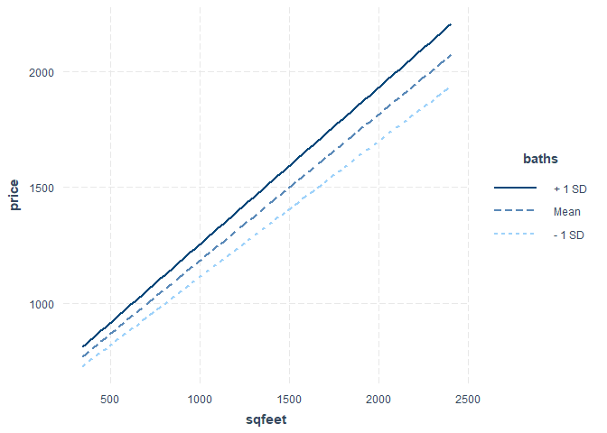
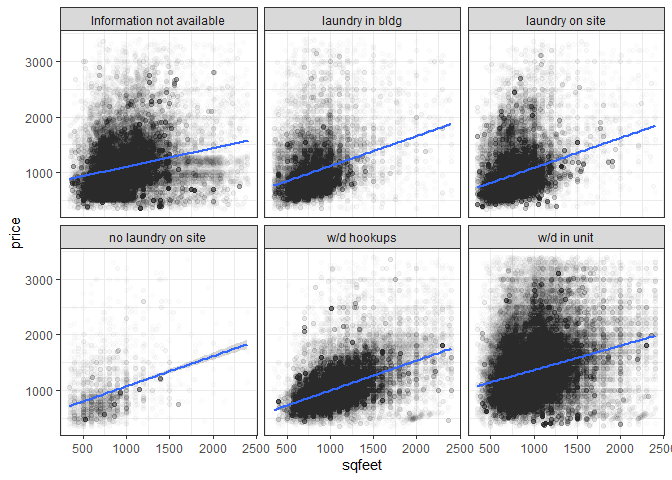
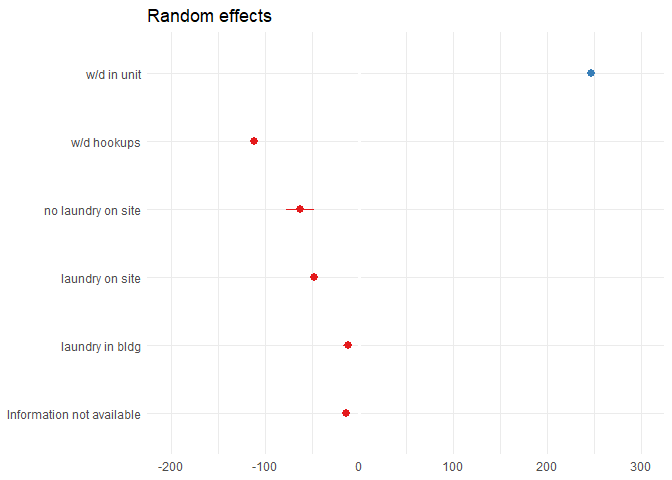
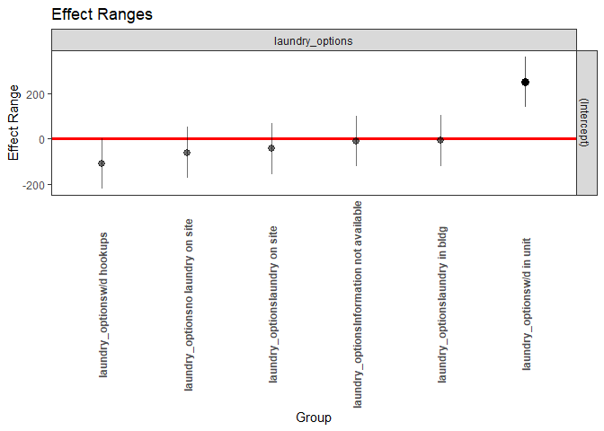
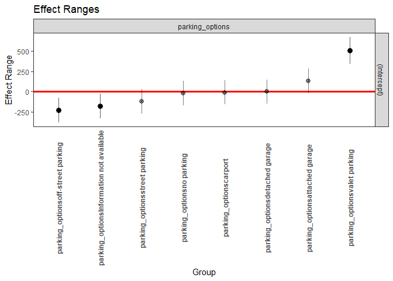
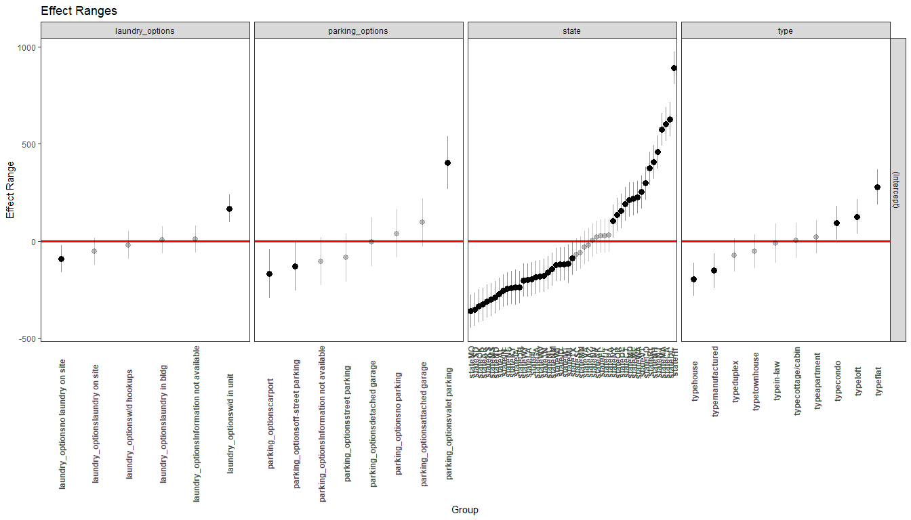
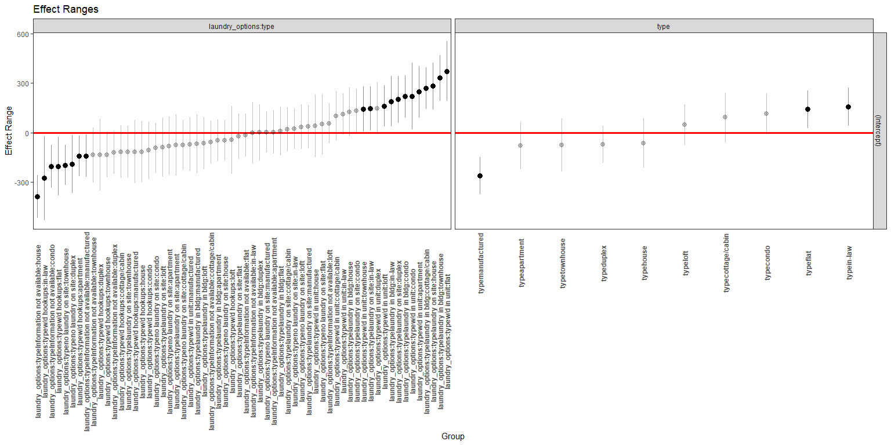
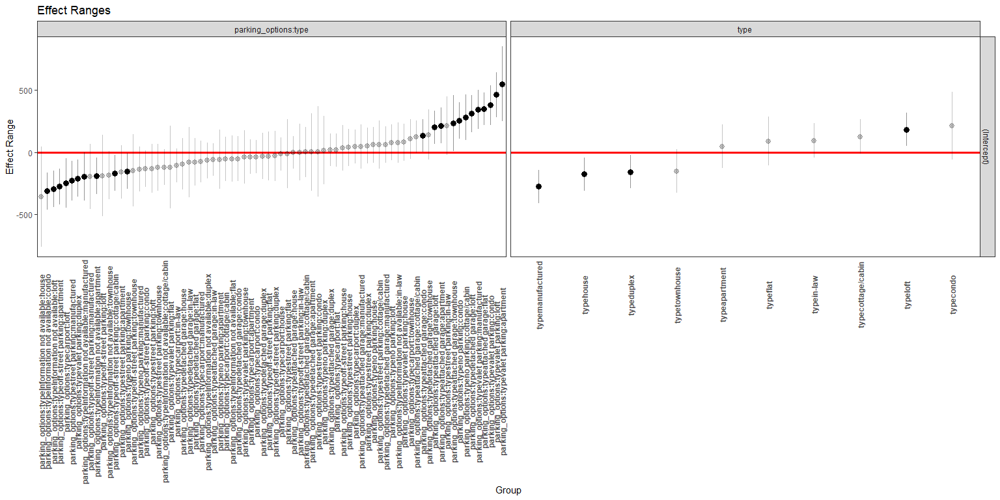
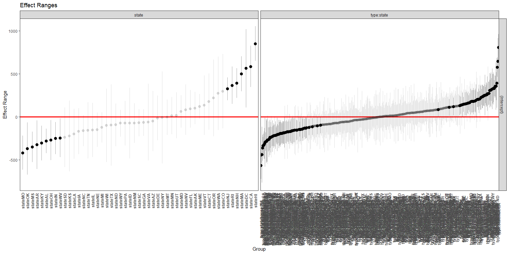

 US
Housing Market (sourse:
<a href="https://www.loveproperty.com/gallerylist/96138/expert-predictions-for-the-us-housing-market-through-the-rest-of-2020" class="uri">https://www.loveproperty.com/gallerylist/96138/expert-predictions-for-the-us-housing-market-through-the-rest-of-2020</a>)

US Housing Rental Market Prediction
===================================

Introduction
============

The dataset is from Kaggle
(<a href="https://www.kaggle.com/austinreese/usa-housing-listings" class="uri">https://www.kaggle.com/austinreese/usa-housing-listings</a>)
which was compiled Craigslist housing information for the United States.
The dataset contains 384,977 rows which represent each housing listing
on the craigslist page. It also has 22 columns which are descriptors of
the house listed. The dependent variable for the data is the monthly
housing rent prices. There is also geographic information which is
interesting because we were able to look at different areas of the
country and what impact the geography had on the housing rent price and
other factors. In the data there are 4 numeric variables: price, size of
the property (sq feet), number of bedrooms, and number of bathrooms.
There are 6 binary variables in the dataset such as: whether cats are
allowed, whether dogs are allowed, whether smoking is allowed,
wheelchair access, electric vehicle charge, and whether it comes
furnished. There are 5 categorical variables including: type, region,
state, laundry\_options, parking options.

``` r
#load packages
library(tidyverse)
library(readr)
library(data.table)
```

Load the data
=============

``` r
housing <- read.csv("data/housing.csv")
```

Clean the data
==============

Take out three columns with urls
--------------------------------

``` r
housing <- housing %>%
  select (-url, -region_url, -image_url)
glimpse(housing)
```

    Rows: 384,977
    Columns: 19
    $ id                      <dbl> 7049044568, 7049047186, 7043634882, 7049045...
    $ region                  <chr> "reno / tahoe", "reno / tahoe", "reno / tah...
    $ price                   <dbl> 1148, 1200, 1813, 1095, 289, 1093, 935, 109...
    $ type                    <chr> "apartment", "condo", "apartment", "apartme...
    $ sqfeet                  <int> 1078, 1001, 1683, 708, 250, 720, 661, 708, ...
    $ beds                    <int> 3, 2, 2, 1, 0, 1, 1, 1, 2, 2, 1, 4, 3, 1, 1...
    $ baths                   <dbl> 2, 2, 2, 1, 1, 1, 1, 1, 2, 2, 1, 3, 2, 1, 1...
    $ cats_allowed            <int> 1, 0, 1, 1, 1, 1, 1, 1, 1, 0, 0, 0, 1, 1, 1...
    $ dogs_allowed            <int> 1, 0, 1, 1, 1, 1, 1, 1, 1, 0, 0, 0, 1, 1, 1...
    $ smoking_allowed         <int> 0, 0, 1, 1, 1, 1, 1, 1, 0, 0, 1, 0, 1, 0, 1...
    $ wheelchair_access       <int> 0, 0, 0, 0, 1, 0, 0, 0, 0, 0, 0, 0, 0, 0, 0...
    $ electric_vehicle_charge <int> 0, 0, 0, 0, 0, 0, 0, 0, 0, 0, 0, 0, 0, 0, 0...
    $ comes_furnished         <int> 0, 0, 0, 0, 1, 0, 0, 0, 0, 0, 0, 0, 0, 0, 0...
    $ laundry_options         <chr> "w/d in unit", "w/d hookups", "w/d in unit"...
    $ parking_options         <chr> "carport", "carport", "attached garage", "c...
    $ description             <chr> "Ridgeview by Vintage is where you will fin...
    $ lat                     <dbl> 39.5483, 39.5026, 39.6269, 39.4477, 39.5357...
    $ long                    <dbl> -119.796, -119.789, -119.708, -119.771, -11...
    $ state                   <chr> "ca", "ca", "ca", "ca", "ca", "ca", "ca", "...

Change data type
----------------

``` r
factorvars <- c('id', 'region', 'type', 'cats_allowed', 'dogs_allowed', 'smoking_allowed','wheelchair_access',  'electric_vehicle_charge', 'comes_furnished',
'laundry_options', 'parking_options','state')
housing <- as.data.table(housing)
housing[, (factorvars):= lapply(.SD, function(x) as.factor(x)), 
                    .SDcols= factorvars]

summary(housing)
```

              id                    region           price          
     7003808130:     1   jacksonville  :  4246   Min.   :0.000e+00  
     7004010416:     1   columbus      :  3738   1st Qu.:8.050e+02  
     7004032234:     1   rochester     :  3677   Median :1.036e+03  
     7004041631:     1   jackson       :  3667   Mean   :8.826e+03  
     7004048100:     1   fayetteville  :  3652   3rd Qu.:1.395e+03  
     7004059925:     1   fredericksburg:  2747   Max.   :2.768e+09  
     (Other)   :384971   (Other)       :363250                      
               type            sqfeet             beds              baths       
     apartment   :318032   Min.   :      0   Min.   :   0.000   Min.   : 0.000  
     house       : 33266   1st Qu.:    750   1st Qu.:   1.000   1st Qu.: 1.000  
     townhouse   : 15885   Median :    949   Median :   2.000   Median : 1.000  
     condo       :  6238   Mean   :   1060   Mean   :   1.905   Mean   : 1.481  
     duplex      :  5047   3rd Qu.:   1150   3rd Qu.:   2.000   3rd Qu.: 2.000  
     manufactured:  4242   Max.   :8388607   Max.   :1100.000   Max.   :75.000  
     (Other)     :  2267                                                        
     cats_allowed dogs_allowed smoking_allowed wheelchair_access
     0:105141     0:112445     0:103262        0:353366         
     1:279836     1:272532     1:281715        1: 31611         
                                                                
                                                                
                                                                
                                                                
                                                                
     electric_vehicle_charge comes_furnished           laundry_options  
     0:380022                0:366449                          : 79026  
     1:  4955                1: 18528        laundry in bldg   : 36103  
                                             laundry on site   : 58873  
                                             no laundry on site:  3624  
                                             w/d hookups       : 75568  
                                             w/d in unit       :131783  
                                                                        
               parking_options   description             lat        
                       :140687   Length:384977      Min.   :-43.53  
     off-street parking:128502   Class :character   1st Qu.: 33.45  
     attached garage   : 40591   Mode  :character   Median : 37.65  
     carport           : 38955                      Mean   : 37.23  
     detached garage   : 16940                      3rd Qu.: 41.14  
     street parking    : 15951                      Max.   :102.04  
     (Other)           :  3351                      NA's   :1918    
          long             state       
     Min.   :-163.89   ca     : 33085  
     1st Qu.:-100.78   fl     : 31929  
     Median : -87.75   tx     : 31137  
     Mean   : -92.70   nc     : 18628  
     3rd Qu.: -81.18   mi     : 14529  
     Max.   : 172.63   ga     : 13841  
     NA's   :1918      (Other):241828  

Trim abnormal records
---------------------

``` r
#check range of the variables
summary(housing$price)
```

         Min.   1st Qu.    Median      Mean   3rd Qu.      Max. 
    0.000e+00 8.050e+02 1.036e+03 8.826e+03 1.395e+03 2.768e+09 

``` r
summary(housing$sqfeet)
```

       Min. 1st Qu.  Median    Mean 3rd Qu.    Max. 
          0     750     949    1060    1150 8388607 

``` r
summary(housing$beds)
```

        Min.  1st Qu.   Median     Mean  3rd Qu.     Max. 
       0.000    1.000    2.000    1.905    2.000 1100.000 

``` r
summary(housing$baths)
```

       Min. 1st Qu.  Median    Mean 3rd Qu.    Max. 
      0.000   1.000   1.000   1.481   2.000  75.000 

``` r
price99 <- quantile(housing$price, .99)
price01 <- quantile(housing$price, .01)

sqfeet99 <- quantile(housing$sqfeet, .99)
sqfeet01 <- quantile(housing$sqfeet, .01)


housing%>% 
  group_by(beds) %>% 
  count()
```

    # A tibble: 11 x 2
    # Groups:   beds [11]
        beds      n
       <int>  <int>
     1     0  10978
     2     1 117226
     3     2 175513
     4     3  67037
     5     4  11575
     6     5   2324
     7     6    240
     8     7     49
     9     8     31
    10  1000      2
    11  1100      2

``` r
housing%>% 
  group_by(baths) %>% 
  count()
```

    # A tibble: 20 x 2
    # Groups:   baths [20]
       baths      n
       <dbl>  <int>
     1   0     3107
     2   1   198184
     3   1.5  27363
     4   2   134649
     5   2.5  13162
     6   3     5549
     7   3.5   1007
     8   4     1495
     9   4.5    231
    10   5      131
    11   5.5     57
    12   6       26
    13   6.5      4
    14   7        4
    15   7.5      2
    16   8        1
    17   8.5      1
    18  25        1
    19  35        1
    20  75        2

Price range, square feet range, beds and baths ranges are all abnormal.
It may be due to mistakes during the web scraping or when people put the
housing information on Craigslist, they didn’t provide the accurate
information. In order to keep the integrity of the data we decide to
trim 1% from the lower end and 1% from the higher end for price and
sqfeet variables. We also filter out beds and baths larger than 10.
Price will range between *$344* to *$3395* per month, and square feet
between *340* to *2405*.

``` r
mydata <- housing %>% 
  filter (price >=price01 & price<=price99) %>% 
  filter (sqfeet >=sqfeet01 & sqfeet <=sqfeet99) %>% 
  filter (beds <= 10) %>% 
  filter (baths <= 10)
#only 10k cases been removed. We still have 374k observations  
summary(mydata)
```

              id                    region           price     
     7003808130:     1   jacksonville  :  4185   Min.   : 344  
     7004010416:     1   jackson       :  3633   1st Qu.: 815  
     7004032234:     1   columbus      :  3611   Median :1035  
     7004041631:     1   rochester     :  3609   Mean   :1157  
     7004048100:     1   fayetteville  :  3598   3rd Qu.:1385  
     7004059925:     1   fredericksburg:  2724   Max.   :3395  
     (Other)   :371079   (Other)       :349725                 
               type            sqfeet          beds           baths      
     apartment   :310039   Min.   : 340   Min.   :0.000   Min.   :0.000  
     house       : 29063   1st Qu.: 750   1st Qu.:1.000   1st Qu.:1.000  
     townhouse   : 15416   Median : 946   Median :2.000   Median :1.000  
     condo       :  5763   Mean   : 978   Mean   :1.879   Mean   :1.467  
     duplex      :  4857   3rd Qu.:1136   3rd Qu.:2.000   3rd Qu.:2.000  
     manufactured:  3991   Max.   :2405   Max.   :8.000   Max.   :7.500  
     (Other)     :  1956                                                 
     cats_allowed dogs_allowed smoking_allowed wheelchair_access
     0: 98422     0:106000     0: 97909        0:341232         
     1:272663     1:265085     1:273176        1: 29853         
                                                                
                                                                
                                                                
                                                                
                                                                
     electric_vehicle_charge comes_furnished           laundry_options  
     0:366590                0:355833                          : 76741  
     1:  4495                1: 15252        laundry in bldg   : 34178  
                                             laundry on site   : 56362  
                                             no laundry on site:  3235  
                                             w/d hookups       : 73645  
                                             w/d in unit       :126924  
                                                                        
               parking_options   description             lat        
                       :137014   Length:371085      Min.   :-40.27  
     off-street parking:124174   Class :character   1st Qu.: 33.44  
     carport           : 38004   Mode  :character   Median : 37.66  
     attached garage   : 37006                      Mean   : 37.23  
     detached garage   : 16263                      3rd Qu.: 41.15  
     street parking    : 15393                      Max.   :102.04  
     (Other)           :  3231                      NA's   :1835    
          long             state       
     Min.   :-163.89   fl     : 31161  
     1st Qu.: -98.55   ca     : 30251  
     Median : -87.63   tx     : 30062  
     Mean   : -92.50   nc     : 18105  
     3rd Qu.: -81.17   mi     : 14213  
     Max.   :  94.16   ga     : 13437  
     NA's   :1835      (Other):233856  

Exploratory Analysis
====================

Depentdent Variable: Price
--------------------------

``` r
library(ggplot2)

summary(mydata$price)
```

       Min. 1st Qu.  Median    Mean 3rd Qu.    Max. 
        344     815    1035    1157    1385    3395 

``` r
ggplot(mydata) + 
  geom_histogram(aes(price), alpha=.5, color="black", fill="skyblue")+
  xlab("Monthly Housing Rent Price")+
  theme_minimal() + 
   theme(panel.grid.major = element_blank(), 
        panel.grid.minor = element_blank(), 
        panel.border = element_blank(), 
        panel.background = element_blank()) 
```


The monthly rent a continuous variable that is not normally distributed.
It is slightly skewed to the right. Mean rent is $1,157, median is
$1,035, 75% of housing monthly rent clustered between $815 to $1385.

Independent Variables
---------------------

### Square Feet: sqfeet

``` r
summary(mydata$sqfeet)
```

       Min. 1st Qu.  Median    Mean 3rd Qu.    Max. 
        340     750     946     978    1136    2405 

``` r
ggplot(mydata) +
  geom_histogram(aes(sqfeet), alpha=.3, color="black", fill="turquoise")+
  xlab("Housing Square Feet")+
  theme_minimal()+ 
  theme(panel.grid.major = element_blank(), 
        panel.grid.minor = element_blank(), 
        panel.border = element_blank(), 
        panel.background = element_blank()) 
```


Square feet is slightly skewed to the right. Mean is 978 square feet,
median is 946 square feet. 75% of the cases range from 750 to 1136
square feet.

### Scatter plot of square feet and montly rent

``` r
library(ggplot2)
ggplot(mydata, aes(x=sqfeet,
                 y=price)) + 
  geom_point(alpha=.01) + 
  geom_smooth()+ 
  geom_smooth(method='lm', color='red') + 
  xlab("Housing Square Feet")+ 
  ylab("Monthly Housing Rent Price") + 
  theme_minimal()+ 
  theme(panel.grid.major = element_blank(), 
        panel.grid.minor = element_blank(), 
        panel.border = element_blank(), 
        panel.background = element_blank()) 
```


There may be a linear relationship here based on the scatter plot.

``` r
ggplot(mydata, aes( x=comes_furnished, y=price, fill=comes_furnished)) + 
  geom_boxplot(alpha=0.5)+ 
  theme_minimal()
```


The furnished houses are slightly higher in median rent prices than
unfurnished. But both have a large range and a lot of outliers.

``` r
ggplot(mydata, aes(x=smoking_allowed, y=price, fill=smoking_allowed)) + 
  geom_boxplot(alpha=0.5)+ 
  theme_minimal()
```


THe houses allowed smoking have a lower median rent price than houses do
not allow smoking, which makes sense.

``` r
ggplot(mydata, aes(x=cats_allowed, y=price, fill=dogs_allowed)) + 
  geom_boxplot(alpha=0.5)+ 
  theme_minimal()
```


The median rent prices for houses do not allow cats but allow dogs is
slightly higher than others.

### Correlation Matrix

``` r
names(mydata)
```

     [1] "id"                      "region"                 
     [3] "price"                   "type"                   
     [5] "sqfeet"                  "beds"                   
     [7] "baths"                   "cats_allowed"           
     [9] "dogs_allowed"            "smoking_allowed"        
    [11] "wheelchair_access"       "electric_vehicle_charge"
    [13] "comes_furnished"         "laundry_options"        
    [15] "parking_options"         "description"            
    [17] "lat"                     "long"                   
    [19] "state"                  

``` r
mydata<- as.data.frame(mydata)
library(PerformanceAnalytics)
cor_vars <- c( "price", "sqfeet", "beds" ,"baths" ,"cats_allowed" ,"dogs_allowed"  , "smoking_allowed" , "wheelchair_access" , "electric_vehicle_charge" , "comes_furnished" )
cor_df <- as.data.frame(mydata)[cor_vars]
cor_df <- cor_df %>%
  mutate_if(is.factor, as.numeric)
corplotmtrix <- chart.Correlation(cor_df, histogram = TRUE,  method = c("pearson"))
```


Confusion matrix plot include all numeric variables and binary
variables. We can see from this matrix plot that independent variables
are correlated with each other, the square feet are highly correlated
with beds and baths, cats allowed is highly correlated with dogs
allowed. This plot helps guide us in the model construction process. We
may need to pay attention to multicollinearity issues.

### Categorical variables:

#### Type of housing: type

``` r
mydata %>% 
  group_by(type) %>% 
  summarize(avg_price = round(mean(price)), count=n()) %>% 
  arrange(desc(count))
```

    # A tibble: 11 x 3
       type          avg_price  count
       <fct>             <dbl>  <int>
     1 apartment          1141 310039
     2 house              1223  29063
     3 townhouse          1255  15416
     4 condo              1481   5763
     5 duplex             1199   4857
     6 manufactured        924   3991
     7 loft               1344    667
     8 cottage/cabin      1227    640
     9 flat               1491    494
    10 in-law             1324    152
    11 land                550      3

The majority of our cases are apartment, house and townhouse. Their mean
prices are different. We may use this variable as a grouping variable
for mixed effect model. We have three 3 cases of land. Let’s check them.

``` r
mydata %>% 
  filter(type=="land")
```

              id          region price type sqfeet beds baths cats_allowed
    1 7030040917        lakeland   350 land    400    1     1            1
    2 7047503378 santa fe / taos   550 land   2000    0     1            1
    3 7029082924       jonesboro   750 land    900    2     1            0
      dogs_allowed smoking_allowed wheelchair_access electric_vehicle_charge
    1            1               1                 0                       0
    2            1               1                 0                       1
    3            0               1                 0                       0
      comes_furnished laundry_options    parking_options
    1               0 laundry on site off-street parking
    2               0     w/d hookups off-street parking
    3               0     w/d in unit off-street parking
                                                                                                                                                                                                                                                                                                                                                                                                                                                                                                                                                                                                                                                                                                                                                                                                                                                                                                                                                                                                                                                                                                                                                                                                                                                                                                                                                                                                                                                                                                                                                                                                                                                                                                                                                                                                                                                                                                                                                                                                                                                                                                                                                                                                                                                                                                                                                                                                                                                                                                                                                                                                                                                                                                                                                                                                                                                                                                                                                                                                                                                                                                                                                                                                                                                                                                                                                                                                                                                                                                                                                                                                                                                                                                                                                                                                                                                                                                                                                                                                                                                                                                                                                                                                                                                                                                                                                                                                description
    1                                                                                                                                                                                                                                                                                                                                                                                                                                                                                                                                                                                                                                                                                                                                                                                                                                                                                                                                                                                                                                                                                                                                                                                                                                                                                                                                                                                                                                                                                                                                                                                                                                                                                                                                                                                                                                                                                                                                                                                                                                                                                                                                                                                                                                                                                                                                                                                                                                                                                                                                                                                                                                                                                                                                                                                                                                                                                                                                                                                                                                                                                                                                                                                                                                                                                                                                                                                                       Lake Juliana Boating and Lodging, a 100 year old central Florida fishcamp known to locals as Lundyville is offering  Recreational Vehicle spaces for yearly lease opportunities. This park is located on Lake Juliana near the convenience of the  I4  corridor to access Lakeland, Orlando areas. The park is secluded on a dead end road with quiet being the mainstay. 126 foot fishing dock, pool, dedicated parking.  The property is also home of the small and intimate Lundyville Music Hall event venue featuring live bands, open mics, karaoke and special musical entertainment events.  RV's  should be no older than 2000.   Water is provided and lawn care is available. Electricity has been updated to 50 amp services with billing through TECO power. Covered boat slips with electric power is available for tenants.  Please contact John at  show contact info  for more information.   Please note: Units including washers will pay additional $15 monthly rental fee.
    2 Now Available: Parking Space for tiny house or RV on land out SF Trail, Below Camp Stoney. Adjoins Wilderness and great trails. It is beautiful out here, and only 20 minutes to town, 12 minutes to Harry's Road House Restaurant or El Gancho Club. Fully paved road to front gate. Walled One Acre already has one one 20 foot RV. Also 2 currently rented Cabin Studio Houses. Has recently refurbished, retiled Bathhouse, with toilet and hot water shower, shared with the Single Person in other Travel Trailer. Delicious Water from well. Electricity via 50 amp RV metered plugin.  High Speed internet included.  Heating not included.  I am providing heat and electricity for the bath house, and propane for the hot water.  Renter pays for usage of electricity for their living unit and provides their propane or wood for cooking and heating.     My daughter and I have several cats,  love animals, and want easy to live with, neighbors and other animals. We live in a valley of pondarosa pines, canyons with access to beautiful long walks as we border on the several thousand acres of the little utilized Camp Stoney Summer Camp. We live on a one-acre walled compound so there is a feeling of enclosure and safety, as well as access to living in the outdoors. Space is available for gardening and composting.  This is an amazing area, close to Santa Fe, yet has a feeling of being far out in the country.  Good for those who enjoy being on the edge, yet surrounded by more nature than city.  This space co-exists with two other fully self contained houses nearby within this compound. We are mostly artists, musicians and those in the healing service professions. There is a great creative energy here, and if the 20 minute drive from Santa Fe is not too far for you, [closer than Eldorado by a few miles] you will love the walks and quiet that exist here.  Amazing dark starry sky.  This is an old, mixed settlement of various cultures here, and my 40 year experience living here, is positive with my neighbors, who are there if you need help or are broken down on the side of the road. It is a country feeling here, and if you can appreciate the old funky ways of New Mexico you will enjoy it here. It is not a covenanted area like El Dorado, in that we have distant neighbors with horses, rabbits, chickens, goats, and the occasional non-running vintage pickup on blocks. It is very quiet and pleasant out here. Most neighboring houses are on several acres. Many comment how amazed they are, that we are so close to Santa Fe, yet have such nature and privacy. The stars are incredible out here.   There is a feeling here, of being on the edge, with access to nature, yet to the plaza is only 20 minutes away, straight down the Old Santa Fe Trail, with only 3 stop signs the entire way to town.   Living on the edge of the Camp Stoney Summer camp with all the land they have is like a sanctuary we adjoin. This is a great place for those who like that closeness and connection to nature. Has wireless internet, with recent high speed upgrade.     Water could be supplied to your unit, by hose, from the well house/bathhouse about 30 feet away.  During freeze months, you would need a tank in your unit that can be filled.   I provide water, and propane for the bathhouse, included in rent.  Grey water could be alright, and but no septic entrances for dark water disposal.  That is where the nearby bathhouse provides toilet access and running, hot/cold water, on a year round basis.  Animals are possible if owner is responsible, and they are no problem to the others here on the property, and my nearby neighbors.   Price of rent determined by size, duration, and how many are using the facilities [The water primarily and electric] and what you need. Basic utililies and Trash removal also included. Around $500-600 per month for one month or more. Talk to me on what you need. 2 week minimum stay with a 2 week agreement.   Space has gardening possibilities, and contains about 2000 square feet of total land or about 50 ft by 40ft. I have had in the past, a tiny home built on this location, as well as mid sized Trailers, RVs and fifth wheels.  In past years, many have stayed through the Winter, using the Bathhouse for water.
    3                                                                                                                                                                                                                                                                                                                                                                                                                                                                                                                                                                                                                                                                                                                                                                                                                                                                                                                                                                                                                                                                                                                                                                                                                                                                                                                                                                                                                                                                                                                                                                                                                                                                                                                                                                                                                                                                                                                                                                                                                                                                                                                                                                                                                                                                                                                                                                                                                                                                                                                                                                                                                                                                                                                                                                                                                                                                                                                                                                                                                                                                                                                                                                                                                                                                                                                                                                                                                                                                                                                                                                                                                                                                                                                                                                                                                                                                                                                                                                                    Hwy 141 @ Craighead/Greene County line.  2 bedroom 1 bath mobile home - partially furnished, or not. Washer/Dryer Refrigerator  Access to Private Fishing Lake  $175 per week or $750/month Utilities are tenant's responsibility  For viewing appointment           Call  show contact info  - Between 7am - 7pm only please.      Or TEXT ONLY  @ (870) 2750-1328 *** calls will not be answered on this number.
          lat      long state
    1 28.1428  -81.8024    fl
    2 35.5690 -105.8550    nm
    3 35.8330  -90.6965    ar

These three cases seem like monthly fees for mobile homes. Since there
are only three cases in this type, and this type is very different from
others, we will drop them for our analysis.

``` r
mydata <- mydata %>% 
  filter(type!="land")
```

#### State

``` r
mydata$state<- toupper(mydata$state)

mydata%>% 
  group_by(state)%>% 
  summarize(avg_price=round(mean(price)), count=n())
```

    # A tibble: 51 x 3
       state avg_price count
       <chr>     <dbl> <int>
     1 AK         1169  2095
     2 AL          881  8093
     3 AR          859  3087
     4 AZ         1051  6453
     5 CA         1744 30251
     6 CO         1471 10824
     7 CT         1338  3673
     8 DC         1810  2369
     9 DE         1275  2007
    10 FL         1219 31160
    # ... with 41 more rows

##### Map by State

``` r
library(ggmap)
library(maps)
library(mapproj)

# Draw a map of the lower 48
states<- map_data("state")

#filter out AK and HI 
df <- filter(mydata,
                  state != "ak" & 
                    state != "hi")

df_low <- df %>% 
  select(state, price, long, lat) %>%
  filter(lat >= 21 & lat <= 50 & long>= -130 & long <= -68.01197, price <3000)


df_high <- df %>% 
  select(state, price, long, lat) %>%
  filter(lat >= 21 & lat <= 50 & long>= -130 & long <= -68.01197, price >=3000) 

  
ggplot()+
  geom_polygon(data=states,
               aes(x=long, 
                   y=lat,
                   group=group),
               color="white",
               fill="grey85") + 
  coord_map()+ 
  geom_point (data=df_low, 
              aes(x=long,
                  y=lat), 
              color="#0C2340")+
   geom_point (data=df_high,
              aes(x=long,
                 y=lat,
                 size=price),
              color="#AE9142", alpha=0.7
               ) +
  scale_size_continuous(range=c(1,5))+
    theme(panel.grid = element_blank(),
        panel.background=element_blank(),
        axis.title=element_blank(),
        axis.ticks=element_blank(),
        axis.text=element_blank(),
        legend.key=element_blank())
```


The mean prices for 51 states are also very different. We may use this
variable as a grouping variable for mixed effect model.

#### Laundry options

``` r
#recode the blank options
mydata$laundry_options <- as.character(mydata$laundry_options)
mydata$laundry_options[mydata$laundry_options==""] <- "Information not available"

mydata$laundry_options <- as.factor(mydata$laundry_options)

summary(mydata$laundry_options)
```

    Information not available           laundry in bldg           laundry on site 
                        76741                     34178                     56361 
           no laundry on site               w/d hookups               w/d in unit 
                         3235                     73644                    126923 

``` r
mydata%>% 
  group_by(laundry_options)%>% 
  summarize(avg_price=round(mean(price)), count=n())
```

    # A tibble: 6 x 3
      laundry_options           avg_price  count
      <fct>                         <dbl>  <int>
    1 Information not available      1101  76741
    2 laundry in bldg                1031  34178
    3 laundry on site                 979  56361
    4 no laundry on site              957   3235
    5 w/d hookups                    1045  73644
    6 w/d in unit                    1375 126923

There are 6 categories in laundry options. We can see that washer/dryer
in unit has the highest mean prices compared to others, which makes
sense. We can add this variable to our linear model, but in that case,
we can only see the comparison of other laundry options to one reference
group. Therefore, we may use this as a grouping variable in mixed effect
model. 76741 cases have no available information about laundry options.

#### Parking option

``` r
#recode the blank options
mydata$parking_options <- as.character(mydata$parking_options)
mydata$parking_options[mydata$parking_options==""] <- "Information not available"

mydata$parking_options <- as.factor(mydata$parking_options)

summary(mydata$parking_options)
```

              attached garage                   carport           detached garage 
                        37006                     38004                     16263 
    Information not available                no parking        off-street parking 
                       137014                      3087                    124171 
               street parking             valet parking 
                        15393                       144 

``` r
mydata%>% 
  group_by(parking_options)%>% 
  summarize(avg_price=round(mean(price)), count=n())
```

    # A tibble: 8 x 3
      parking_options           avg_price  count
      <fct>                         <dbl>  <int>
    1 attached garage                1529  37006
    2 carport                        1261  38004
    3 detached garage                1323  16263
    4 Information not available      1108 137014
    5 no parking                     1238   3087
    6 off-street parking             1045 124171
    7 street parking                 1154  15393
    8 valet parking                  1787    144

There are 8 categories in parking options. WE can see that valet parking
has the highest mean prices compared to others. Same as laundry options,
We decide to use this as a grouping variable in mixed effect model.
137014 cases have no available information about parking options.

#### Region

``` r
mydata%>% 
  group_by(region)%>% 
  summarize(avg_price=round(mean(price)), count=n())
```

    # A tibble: 404 x 3
       region             avg_price count
       <fct>                  <dbl> <int>
     1 abilene                  792   891
     2 akron / canton           850  1508
     3 albany                  1025  2046
     4 albuquerque              900  2053
     5 altoona-johnstown        815   245
     6 amarillo                 657  1341
     7 ames                     825   354
     8 anchorage / mat-su      1150  1654
     9 ann arbor               1249  2215
    10 annapolis               1588  2041
    # ... with 394 more rows

There are 404 unique regions in our data set. The regions are not
cleaned. Some indicate a city, a town, or an area, and some just
indicate part of the state. Some regions have fewer than 10 cases. We
decide not to use it as a grouping variable for mixed effect model,
because the results may be less informative due to the poor quality of
the data.

Research Question and Hypotheses
================================

Our major question of this data is: *What are the major factors that
drive up or down the monthly housing rent prices?*

-   Hypothesis1: Square feet has a positive influence on monthly rent
    prices.

-   Hypothesis2: Beds and baths have positive influence on monthly rent
    prices.

-   Hypothesis3: Cats allowed and dogs allowed have negative influence
    on monthly rent prices, when controlling for square feet.

-   Hypothesis4: Smoking allowed has a negative influence on monthly
    rent prices, when controlling for square feet.

-   Hypothesis5: Houses with Wheelchair access, electric vehicle charge,
    and furnished will have a higher monthly rent price, when
    controlling for square feet.

-   Hypothesis6: square feet’s influence on monthly rent prices varies
    by type.

-   Hypothesis7: square feet’s influence on monthly rent prices varies
    by state.

-   Hypothesis8: square feet’s influence on monthly rent prices varies
    by laundry options.

-   Hypothesis9: square feet’s influence on monthly rent prices varies
    by parking options.

-   Hypothesis10: square feet’s influence on monthly rent prices varies
    by laundry options nested in types of housing.

-   Hypothesis11: square feet’s influence on monthly rent prices varies
    by parking options nested in types of housing.

-   Hypothesis12: square feet’s influence on monthly rent prices varies
    by types of housing nested in state.

A priori power analysis
=======================

``` r
library(pwr)
k = 20
adjR2 = 0.01
pwrAnalysis <- pwr.f2.test(u = k-1, f2 = (adjR2 / (1-adjR2)), sig.level = 0.05, power = 0.8)
pwrAnalysis
```


         Multiple regression power calculation 

                  u = 19
                  v = 2030.096
                 f2 = 0.01010101
          sig.level = 0.05
              power = 0.8

``` r
sampSize = floor(pwrAnalysis$u + pwrAnalysis$v + 1)+1
sampSize
```

    [1] 2051

We will have multivariate linear models and mixed effect models. If our
largest model have 20 terms, we will need 2051 observations to detect a
1% effect from the model. We have 371082 observations, so we have more
than enough cases for our study.

Model construction
==================

Smiple linear regressions
-------------------------

``` r
lm1 <- lm(price ~ sqfeet, data = mydata)
summary(lm1)
```


    Call:
    lm(formula = price ~ sqfeet, data = mydata)

    Residuals:
        Min      1Q  Median      3Q     Max 
    -1446.5  -303.9  -102.5   204.7  2439.9 

    Coefficients:
                 Estimate Std. Error t value Pr(>|t|)    
    (Intercept) 6.838e+02  2.440e+00   280.2   <2e-16 ***
    sqfeet      4.841e-01  2.373e-03   204.0   <2e-16 ***
    ---
    Signif. codes:  0 '***' 0.001 '**' 0.01 '*' 0.05 '.' 0.1 ' ' 1

    Residual standard error: 459 on 371080 degrees of freedom
    Multiple R-squared:  0.1009,    Adjusted R-squared:  0.1009 
    F-statistic: 4.162e+04 on 1 and 371080 DF,  p-value: < 2.2e-16

``` r
par(mfrow=c(2,2))
plot(lm1)
```


The simple linear regression of square feet and monthly rent price shows
a significant relationship between the two. The model’s adjusted
R-squared is 0.1009, so square feet explains 10.09% of variance in
monthly rent prices. Each additional square feet increase will lead to
0.484 increase of monthly rent price. coefficient is not very large, but
it is highly significant. Our hypothesis 1 is supported. The plots show
that the residuals and fitted values scatter plots are relatively
random. The residual values are not completely normal in normal Q-Q
plot.

However, we would like to dig deeper to see how other variables
influence on monthly rent prices.

``` r
lm2 <- lm(price ~ beds + baths, data = mydata)
summary(lm2)
```


    Call:
    lm(formula = price ~ beds + baths, data = mydata)

    Residuals:
        Min      1Q  Median      3Q     Max 
    -1575.9  -318.1  -106.9   215.1  2375.6 

    Coefficients:
                Estimate Std. Error t value Pr(>|t|)    
    (Intercept)  852.369      2.223   383.4   <2e-16 ***
    beds          11.022      1.173     9.4   <2e-16 ***
    baths        193.730      1.735   111.7   <2e-16 ***
    ---
    Signif. codes:  0 '***' 0.001 '**' 0.01 '*' 0.05 '.' 0.1 ' ' 1

    Residual standard error: 470 on 371079 degrees of freedom
    Multiple R-squared:  0.05754,   Adjusted R-squared:  0.05754 
    F-statistic: 1.133e+04 on 2 and 371079 DF,  p-value: < 2.2e-16

``` r
car::vif(lm2)
```

        beds    baths 
    1.633673 1.633673 

When we just include beds and baths in the linear model, both of them
are positively related to price. The model is statistically significant,
but the adjusted R-squared is only 0.0575, so beds and baths can only
explain 5.75% of variance in price. Every additional bed will lead to
$11 increase in monthly rent, and every additional bath will lead to
$193.7 increase in monthly rent. The vif scores show that
multicollinearity is not severe here. We add an interaction term for
beds and baths.

``` r
lm2_int <- lm(price ~  beds * baths, data = mydata)

summary(lm2_int)
```


    Call:
    lm(formula = price ~ beds * baths, data = mydata)

    Residuals:
        Min      1Q  Median      3Q     Max 
    -1242.7  -320.5  -104.8   212.0  2439.5 

    Coefficients:
                Estimate Std. Error t value Pr(>|t|)    
    (Intercept)  686.849      5.023  136.73   <2e-16 ***
    beds          87.658      2.392   36.64   <2e-16 ***
    baths        323.624      3.938   82.19   <2e-16 ***
    beds:baths   -55.344      1.507  -36.73   <2e-16 ***
    ---
    Signif. codes:  0 '***' 0.001 '**' 0.01 '*' 0.05 '.' 0.1 ' ' 1

    Residual standard error: 469.1 on 371078 degrees of freedom
    Multiple R-squared:  0.06095,   Adjusted R-squared:  0.06095 
    F-statistic:  8029 on 3 and 371078 DF,  p-value: < 2.2e-16

``` r
library(interactions)

interact_plot(lm2_int, pred = beds, modx = baths)
```


``` r
interact_plot(lm2_int, pred = baths, modx = beds)
```


The interaction term is statistically significant, and the adjusted
R-squared slightly increased to 0.06. The effect of beds on price is
positive with lower numbers of baths, but negative with higher numbers
of baths. Our hypothesis 2 is supported.

``` r
lm2a <- lm(price ~ sqfeet + beds + baths , data = mydata)
summary(lm2a)
```


    Call:
    lm(formula = price ~ sqfeet + beds + baths, data = mydata)

    Residuals:
        Min      1Q  Median      3Q     Max 
    -1794.8  -297.7  -100.6   199.3  2589.8 

    Coefficients:
                  Estimate Std. Error t value Pr(>|t|)    
    (Intercept)  6.373e+02  2.496e+00  255.35   <2e-16 ***
    sqfeet       6.511e-01  3.874e-03  168.07   <2e-16 ***
    beds        -1.357e+02  1.428e+00  -95.04   <2e-16 ***
    baths        9.426e+01  1.774e+00   53.13   <2e-16 ***
    ---
    Signif. codes:  0 '***' 0.001 '**' 0.01 '*' 0.05 '.' 0.1 ' ' 1

    Residual standard error: 453 on 371078 degrees of freedom
    Multiple R-squared:  0.1242,    Adjusted R-squared:  0.1242 
    F-statistic: 1.754e+04 on 3 and 371078 DF,  p-value: < 2.2e-16

``` r
car::vif(lm2a)
```

      sqfeet     beds    baths 
    2.736125 2.608752 1.838312 

When we add square feet in the model, beds’ coefficient becomes
negative. We thought that there may be a multicollinearity issue with
square feet, beds and baths. However, the vif scores do not exceed 5, so
the multicollinearity issue is not as severe as we expected for square
feet, beds and baths. We still include the interaction terms in our
following model.

``` r
lm2a_int <- lm(price ~ sqfeet * (beds + baths) + beds * baths, data = mydata)

summary(lm2a_int)
```


    Call:
    lm(formula = price ~ sqfeet * (beds + baths) + beds * baths, 
        data = mydata)

    Residuals:
        Min      1Q  Median      3Q     Max 
    -2349.7  -299.3  -101.4   199.6  2631.7 

    Coefficients:
                   Estimate Std. Error t value Pr(>|t|)    
    (Intercept)  529.134830   6.605775  80.102  < 2e-16 ***
    sqfeet         0.502164   0.010990  45.694  < 2e-16 ***
    beds         -21.515957   3.977423  -5.410 6.32e-08 ***
    baths        201.254277   6.227670  32.316  < 2e-16 ***
    sqfeet:beds    0.006158   0.003065   2.009   0.0445 *  
    sqfeet:baths   0.079462   0.005793  13.717  < 2e-16 ***
    beds:baths   -83.035177   2.283798 -36.358  < 2e-16 ***
    ---
    Signif. codes:  0 '***' 0.001 '**' 0.01 '*' 0.05 '.' 0.1 ' ' 1

    Residual standard error: 451.9 on 371075 degrees of freedom
    Multiple R-squared:  0.1285,    Adjusted R-squared:  0.1285 
    F-statistic:  9119 on 6 and 371075 DF,  p-value: < 2.2e-16

The interaction term of beds and baths is significant in this model. The
interaction term of square feet and beds is just above the significant
level, and the interaction term of square feet and baths is highly
significant. The adjusted R-squared is 0.1285, so the independent
variables explain 12.85% of variance in price.

``` r
interact_plot(lm2a_int, pred = sqfeet, modx = baths)
```



``` r
interact_plot(lm2a_int, pred = sqfeet, modx = beds)
```


``` r
interact_plot(lm2a_int, pred = beds, modx = baths)
```


``` r
interact_plot(lm2a_int, pred = baths, modx = beds)
```


The interaction effects of square feet and baths, square feet and beds
are not very strong. Beds effect on price is negative when controlling
for square feet. The negative slope is steeper with higher numbers of
baths. Controlling for square feet, houses with more beds are cheaper.

``` r
lm3 <- lm(price ~ sqfeet + dogs_allowed + cats_allowed, data=mydata)
summary(lm3)
```


    Call:
    lm(formula = price ~ sqfeet + dogs_allowed + cats_allowed, data = mydata)

    Residuals:
        Min      1Q  Median      3Q     Max 
    -1450.0  -303.9  -102.9   204.8  2442.4 

    Coefficients:
                    Estimate Std. Error t value Pr(>|t|)    
    (Intercept)   681.473445   2.835814  240.31   <2e-16 ***
    sqfeet          0.486696   0.002386  203.97   <2e-16 ***
    dogs_allowed1 -48.932913   3.633756  -13.47   <2e-16 ***
    cats_allowed1  47.338939   3.727564   12.70   <2e-16 ***
    ---
    Signif. codes:  0 '***' 0.001 '**' 0.01 '*' 0.05 '.' 0.1 ' ' 1

    Residual standard error: 458.9 on 371078 degrees of freedom
    Multiple R-squared:  0.1013,    Adjusted R-squared:  0.1013 
    F-statistic: 1.394e+04 on 3 and 371078 DF,  p-value: < 2.2e-16

``` r
car::vif(lm3)
```

          sqfeet dogs_allowed cats_allowed 
        1.011571     4.747170     4.770903 

The model is significant with ajusted R-squared of 0.1013. 10.13% of
variance in price are explained by independent variables. All variables
are significant in the model. Dogs allowed is negatively related to
price while cats allowed is positively related to price. According to
the vif scores, the dogs allowed and cats allowed have some issues of
multicollinearity, but not severe. Let’s include interaction terms for
them.

``` r
lm3_int <- lm(price ~ sqfeet * (dogs_allowed + cats_allowed ) + dogs_allowed * cats_allowed , data=mydata)
summary(lm3_int)
```


    Call:
    lm(formula = price ~ sqfeet * (dogs_allowed + cats_allowed) + 
        dogs_allowed * cats_allowed, data = mydata)

    Residuals:
        Min      1Q  Median      3Q     Max 
    -1448.6  -303.3  -102.5   204.6  2444.0 

    Coefficients:
                                  Estimate Std. Error t value Pr(>|t|)    
    (Intercept)                  6.859e+02  4.492e+00 152.703  < 2e-16 ***
    sqfeet                       4.796e-01  4.189e-03 114.469  < 2e-16 ***
    dogs_allowed1                8.515e+01  1.437e+01   5.924 3.14e-09 ***
    cats_allowed1                8.297e+00  1.050e+01   0.790    0.429    
    sqfeet:dogs_allowed1        -6.065e-02  1.042e-02  -5.822 5.80e-09 ***
    sqfeet:cats_allowed1         6.915e-02  1.048e-02   6.600 4.12e-11 ***
    dogs_allowed1:cats_allowed1 -1.018e+02  8.773e+00 -11.606  < 2e-16 ***
    ---
    Signif. codes:  0 '***' 0.001 '**' 0.01 '*' 0.05 '.' 0.1 ' ' 1

    Residual standard error: 458.8 on 371075 degrees of freedom
    Multiple R-squared:  0.1016,    Adjusted R-squared:  0.1016 
    F-statistic:  6998 on 6 and 371075 DF,  p-value: < 2.2e-16

The interaction terms are all highly statistically significant, but
cats\_allowed is no longer significant here. The adjusted R-squared only
slighly increased from 0.1013 to 0.1016.

``` r
interact_plot(lm3_int, pred = sqfeet, modx = dogs_allowed)
```


``` r
interact_plot(lm3_int, pred = sqfeet, modx = cats_allowed)
```


``` r
library(effects)

modelEffects <- effect("dogs_allowed * cats_allowed", lm3_int)
plot(modelEffects)
```


It is interesting to see that the dogs allowed and cats allowed have
different interaction effect with square feet on price. Dogs not allowed
houses have a slightly steeper slope for square feet on price than dogs
allowed houses. For smaller houses, dogs allowed houses are more
expensive than dogs not allowed, but for larger houses, dogs allowed
houses are less expensive than dogs not allowed. Cats allowed houses
have a slightly steeper slope for square feet on price than cats not
allowed houses. Cats allowed houses are generally more expensive than
cats not allowed houses. The interaction of cats allowed and dogs
allowed reveals an interesting result. For houses not allowing cats, if
they allow dogs, the price will be higher. For houses allowing cats, if
they allow dogs, the price will be lower. The highest price is the
houses allow cats, but not allow dogs.

The hypothesis 3 is not fully supported. The interaction effect is more
important here.

``` r
lm4 <- lm(price ~ sqfeet + smoking_allowed + wheelchair_access + electric_vehicle_charge + comes_furnished, data = mydata)
summary(lm4)
```


    Call:
    lm(formula = price ~ sqfeet + smoking_allowed + wheelchair_access + 
        electric_vehicle_charge + comes_furnished, data = mydata)

    Residuals:
         Min       1Q   Median       3Q      Max 
    -1572.62  -293.99   -94.46   202.19  2511.79 

    Coefficients:
                               Estimate Std. Error t value Pr(>|t|)    
    (Intercept)               7.917e+02  2.797e+00  283.00   <2e-16 ***
    sqfeet                    4.787e-01  2.329e-03  205.53   <2e-16 ***
    smoking_allowed1         -1.511e+02  1.735e+00  -87.08   <2e-16 ***
    wheelchair_access1        6.657e+01  2.865e+00   23.24   <2e-16 ***
    electric_vehicle_charge1  4.385e+02  6.885e+00   63.69   <2e-16 ***
    comes_furnished1         -4.892e+01  3.829e+00  -12.78   <2e-16 ***
    ---
    Signif. codes:  0 '***' 0.001 '**' 0.01 '*' 0.05 '.' 0.1 ' ' 1

    Residual standard error: 450 on 371076 degrees of freedom
    Multiple R-squared:  0.136, Adjusted R-squared:  0.136 
    F-statistic: 1.168e+04 on 5 and 371076 DF,  p-value: < 2.2e-16

``` r
car::vif(lm4)
```

                     sqfeet         smoking_allowed       wheelchair_access 
                   1.002559                1.071361                1.112745 
    electric_vehicle_charge         comes_furnished 
                   1.039193                1.058738 

This model includes all of the other binary variables. The model is
significant. Adjusted R-squared is 0.136, so the independent variables
explain 13.6% of the varaince in price. All independent variables are
significant. The smoking allowed is negatively related to price. A house
allowing smoking will be $151 cheaper than house not allowing smoking. A
house with wheel chair access will be $6.657 higher than house without
wheel chair access. A house with electric vehicle charge will be $43.85
higher than house without electric vehicle charge. A furnished house
will be $4.89 higher than house not furnished.

The vif scores show that there is no multicollinearity issue.

The hypothesis 4 and 5 are supported. We also add the interaction terms
in the following model.

``` r
lm4_int <- lm(price ~ sqfeet * (smoking_allowed + wheelchair_access + electric_vehicle_charge + comes_furnished), data = mydata)
summary(lm4_int)
```


    Call:
    lm(formula = price ~ sqfeet * (smoking_allowed + wheelchair_access + 
        electric_vehicle_charge + comes_furnished), data = mydata)

    Residuals:
         Min       1Q   Median       3Q      Max 
    -1673.70  -292.75   -95.97   201.91  2470.13 

    Coefficients:
                                      Estimate Std. Error t value Pr(>|t|)    
    (Intercept)                     686.381394   4.723853 145.301  < 2e-16 ***
    sqfeet                            0.582306   0.004433 131.362  < 2e-16 ***
    smoking_allowed1                -36.308657   5.382297  -6.746 1.52e-11 ***
    wheelchair_access1              126.470173   9.174267  13.785  < 2e-16 ***
    electric_vehicle_charge1        765.051353  21.076530  36.299  < 2e-16 ***
    comes_furnished1                191.103490  10.162034  18.806  < 2e-16 ***
    sqfeet:smoking_allowed1          -0.113089   0.005113 -22.117  < 2e-16 ***
    sqfeet:wheelchair_access1        -0.061074   0.009031  -6.762 1.36e-11 ***
    sqfeet:electric_vehicle_charge1  -0.326663   0.020489 -15.943  < 2e-16 ***
    sqfeet:comes_furnished1          -0.232376   0.009239 -25.152  < 2e-16 ***
    ---
    Signif. codes:  0 '***' 0.001 '**' 0.01 '*' 0.05 '.' 0.1 ' ' 1

    Residual standard error: 449.1 on 371072 degrees of freedom
    Multiple R-squared:  0.1393,    Adjusted R-squared:  0.1393 
    F-statistic:  6674 on 9 and 371072 DF,  p-value: < 2.2e-16

The interaction terms are all significant. The adjusted R-squared
slightly increased from 0.136 to 0.1393. The interaction effects are
plotted as follows:

``` r
interact_plot(lm4_int, pred = sqfeet, modx = smoking_allowed)
```


``` r
interact_plot(lm4_int, pred = sqfeet, modx = wheelchair_access)
```


``` r
interact_plot(lm4_int, pred = sqfeet, modx = electric_vehicle_charge)
```


``` r
interact_plot(lm4_int, pred = sqfeet, modx = comes_furnished)
```


Based on the plots, we can see that houses not allowing smoking the
slope of square feet on price is steeper than houses allowing smoking.
Houses without wheel chair access have slightly steeper slope for square
feet on price. Houses with electric vehicle charge generally higher on
price, but square feet’s slope is steeper for houses without electric
vehicle charge. The houses not furnished also have a steeper slope than
furnished houses.

``` r
lmAll_int <- lm(price ~ sqfeet*(dogs_allowed + cats_allowed + smoking_allowed + wheelchair_access + electric_vehicle_charge + comes_furnished ) + dogs_allowed * cats_allowed + beds*baths, data = mydata)
summary(lmAll_int)
```


    Call:
    lm(formula = price ~ sqfeet * (dogs_allowed + cats_allowed + 
        smoking_allowed + wheelchair_access + electric_vehicle_charge + 
        comes_furnished) + dogs_allowed * cats_allowed + beds * baths, 
        data = mydata)

    Residuals:
         Min       1Q   Median       3Q      Max 
    -1936.33  -287.99   -92.31   193.97  2553.49 

    Coefficients:
                                      Estimate Std. Error t value Pr(>|t|)    
    (Intercept)                     513.208639   7.317846  70.131  < 2e-16 ***
    sqfeet                            0.697245   0.005906 118.067  < 2e-16 ***
    dogs_allowed1                    58.156261  13.894665   4.186 2.85e-05 ***
    cats_allowed1                   -28.873711  10.193663  -2.833  0.00462 ** 
    smoking_allowed1                -37.800103   5.327410  -7.095 1.29e-12 ***
    wheelchair_access1              130.823955   9.180501  14.250  < 2e-16 ***
    electric_vehicle_charge1        771.639326  20.772472  37.147  < 2e-16 ***
    comes_furnished1                180.375101  10.064415  17.922  < 2e-16 ***
    beds                            -48.491093   2.435988 -19.906  < 2e-16 ***
    baths                           228.841329   3.799617  60.227  < 2e-16 ***
    sqfeet:dogs_allowed1             -0.051187   0.010072  -5.082 3.74e-07 ***
    sqfeet:cats_allowed1              0.099775   0.010174   9.807  < 2e-16 ***
    sqfeet:smoking_allowed1          -0.107726   0.005073 -21.234  < 2e-16 ***
    sqfeet:wheelchair_access1        -0.075308   0.009038  -8.332  < 2e-16 ***
    sqfeet:electric_vehicle_charge1  -0.347810   0.020195 -17.222  < 2e-16 ***
    sqfeet:comes_furnished1          -0.207965   0.009161 -22.701  < 2e-16 ***
    dogs_allowed1:cats_allowed1     -94.999280   8.483684 -11.198  < 2e-16 ***
    beds:baths                      -57.287445   1.438263 -39.831  < 2e-16 ***
    ---
    Signif. codes:  0 '***' 0.001 '**' 0.01 '*' 0.05 '.' 0.1 ' ' 1

    Residual standard error: 442.4 on 371064 degrees of freedom
    Multiple R-squared:  0.1648,    Adjusted R-squared:  0.1647 
    F-statistic:  4305 on 17 and 371064 DF,  p-value: < 2.2e-16

``` r
par(mfrow=c(2,2))
plot(lmAll_int)
```


When we add all variables and interaction terms in the final linear
model, the coefficients are all significant. The model is statistically
significant. The adjusted R-squared is 0.1647, so 16.47% of variance in
price are explained by the independent variables.

### List all models

``` r
stargazer::stargazer(lm1, lm2, lm2_int, lm2a, lm2a_int, lm3_int, lm4_int, lmAll_int, type = "html", header = FALSE)
```

<table style="text-align:center">
<tr>
<td colspan="9" style="border-bottom: 1px solid black">
</td>
</tr>
<tr>
<td style="text-align:left">
</td>
<td colspan="8">
<em>Dependent variable:</em>
</td>
</tr>
<tr>
<td>
</td>
<td colspan="8" style="border-bottom: 1px solid black">
</td>
</tr>
<tr>
<td style="text-align:left">
</td>
<td colspan="8">
price
</td>
</tr>
<tr>
<td style="text-align:left">
</td>
<td>
(1)
</td>
<td>
(2)
</td>
<td>
(3)
</td>
<td>
(4)
</td>
<td>
(5)
</td>
<td>
(6)
</td>
<td>
(7)
</td>
<td>
(8)
</td>
</tr>
<tr>
<td colspan="9" style="border-bottom: 1px solid black">
</td>
</tr>
<tr>
<td style="text-align:left">
sqfeet
</td>
<td>
0.484<sup>\*\*\*</sup>
</td>
<td>
</td>
<td>
</td>
<td>
0.651<sup>\*\*\*</sup>
</td>
<td>
0.502<sup>\*\*\*</sup>
</td>
<td>
0.480<sup>\*\*\*</sup>
</td>
<td>
0.582<sup>\*\*\*</sup>
</td>
<td>
0.697<sup>\*\*\*</sup>
</td>
</tr>
<tr>
<td style="text-align:left">
</td>
<td>
(0.002)
</td>
<td>
</td>
<td>
</td>
<td>
(0.004)
</td>
<td>
(0.011)
</td>
<td>
(0.004)
</td>
<td>
(0.004)
</td>
<td>
(0.006)
</td>
</tr>
<tr>
<td style="text-align:left">
</td>
<td>
</td>
<td>
</td>
<td>
</td>
<td>
</td>
<td>
</td>
<td>
</td>
<td>
</td>
<td>
</td>
</tr>
<tr>
<td style="text-align:left">
beds
</td>
<td>
</td>
<td>
11.022<sup>\*\*\*</sup>
</td>
<td>
87.658<sup>\*\*\*</sup>
</td>
<td>
-135.744<sup>\*\*\*</sup>
</td>
<td>
-21.516<sup>\*\*\*</sup>
</td>
<td>
</td>
<td>
</td>
<td>
-48.491<sup>\*\*\*</sup>
</td>
</tr>
<tr>
<td style="text-align:left">
</td>
<td>
</td>
<td>
(1.173)
</td>
<td>
(2.392)
</td>
<td>
(1.428)
</td>
<td>
(3.977)
</td>
<td>
</td>
<td>
</td>
<td>
(2.436)
</td>
</tr>
<tr>
<td style="text-align:left">
</td>
<td>
</td>
<td>
</td>
<td>
</td>
<td>
</td>
<td>
</td>
<td>
</td>
<td>
</td>
<td>
</td>
</tr>
<tr>
<td style="text-align:left">
baths
</td>
<td>
</td>
<td>
193.730<sup>\*\*\*</sup>
</td>
<td>
323.624<sup>\*\*\*</sup>
</td>
<td>
94.256<sup>\*\*\*</sup>
</td>
<td>
201.254<sup>\*\*\*</sup>
</td>
<td>
</td>
<td>
</td>
<td>
228.841<sup>\*\*\*</sup>
</td>
</tr>
<tr>
<td style="text-align:left">
</td>
<td>
</td>
<td>
(1.735)
</td>
<td>
(3.938)
</td>
<td>
(1.774)
</td>
<td>
(6.228)
</td>
<td>
</td>
<td>
</td>
<td>
(3.800)
</td>
</tr>
<tr>
<td style="text-align:left">
</td>
<td>
</td>
<td>
</td>
<td>
</td>
<td>
</td>
<td>
</td>
<td>
</td>
<td>
</td>
<td>
</td>
</tr>
<tr>
<td style="text-align:left">
sqfeet:beds
</td>
<td>
</td>
<td>
</td>
<td>
</td>
<td>
</td>
<td>
0.006<sup>\*\*</sup>
</td>
<td>
</td>
<td>
</td>
<td>
</td>
</tr>
<tr>
<td style="text-align:left">
</td>
<td>
</td>
<td>
</td>
<td>
</td>
<td>
</td>
<td>
(0.003)
</td>
<td>
</td>
<td>
</td>
<td>
</td>
</tr>
<tr>
<td style="text-align:left">
</td>
<td>
</td>
<td>
</td>
<td>
</td>
<td>
</td>
<td>
</td>
<td>
</td>
<td>
</td>
<td>
</td>
</tr>
<tr>
<td style="text-align:left">
sqfeet:baths
</td>
<td>
</td>
<td>
</td>
<td>
</td>
<td>
</td>
<td>
0.079<sup>\*\*\*</sup>
</td>
<td>
</td>
<td>
</td>
<td>
</td>
</tr>
<tr>
<td style="text-align:left">
</td>
<td>
</td>
<td>
</td>
<td>
</td>
<td>
</td>
<td>
(0.006)
</td>
<td>
</td>
<td>
</td>
<td>
</td>
</tr>
<tr>
<td style="text-align:left">
</td>
<td>
</td>
<td>
</td>
<td>
</td>
<td>
</td>
<td>
</td>
<td>
</td>
<td>
</td>
<td>
</td>
</tr>
<tr>
<td style="text-align:left">
beds:baths
</td>
<td>
</td>
<td>
</td>
<td>
-55.344<sup>\*\*\*</sup>
</td>
<td>
</td>
<td>
-83.035<sup>\*\*\*</sup>
</td>
<td>
</td>
<td>
</td>
<td>
-57.287<sup>\*\*\*</sup>
</td>
</tr>
<tr>
<td style="text-align:left">
</td>
<td>
</td>
<td>
</td>
<td>
(1.507)
</td>
<td>
</td>
<td>
(2.284)
</td>
<td>
</td>
<td>
</td>
<td>
(1.438)
</td>
</tr>
<tr>
<td style="text-align:left">
</td>
<td>
</td>
<td>
</td>
<td>
</td>
<td>
</td>
<td>
</td>
<td>
</td>
<td>
</td>
<td>
</td>
</tr>
<tr>
<td style="text-align:left">
dogs\_allowed1
</td>
<td>
</td>
<td>
</td>
<td>
</td>
<td>
</td>
<td>
</td>
<td>
85.154<sup>\*\*\*</sup>
</td>
<td>
</td>
<td>
58.156<sup>\*\*\*</sup>
</td>
</tr>
<tr>
<td style="text-align:left">
</td>
<td>
</td>
<td>
</td>
<td>
</td>
<td>
</td>
<td>
</td>
<td>
(14.374)
</td>
<td>
</td>
<td>
(13.895)
</td>
</tr>
<tr>
<td style="text-align:left">
</td>
<td>
</td>
<td>
</td>
<td>
</td>
<td>
</td>
<td>
</td>
<td>
</td>
<td>
</td>
<td>
</td>
</tr>
<tr>
<td style="text-align:left">
cats\_allowed1
</td>
<td>
</td>
<td>
</td>
<td>
</td>
<td>
</td>
<td>
</td>
<td>
8.297
</td>
<td>
</td>
<td>
-28.874<sup>\*\*\*</sup>
</td>
</tr>
<tr>
<td style="text-align:left">
</td>
<td>
</td>
<td>
</td>
<td>
</td>
<td>
</td>
<td>
</td>
<td>
(10.500)
</td>
<td>
</td>
<td>
(10.194)
</td>
</tr>
<tr>
<td style="text-align:left">
</td>
<td>
</td>
<td>
</td>
<td>
</td>
<td>
</td>
<td>
</td>
<td>
</td>
<td>
</td>
<td>
</td>
</tr>
<tr>
<td style="text-align:left">
sqfeet:dogs\_allowed1
</td>
<td>
</td>
<td>
</td>
<td>
</td>
<td>
</td>
<td>
</td>
<td>
-0.061<sup>\*\*\*</sup>
</td>
<td>
</td>
<td>
-0.051<sup>\*\*\*</sup>
</td>
</tr>
<tr>
<td style="text-align:left">
</td>
<td>
</td>
<td>
</td>
<td>
</td>
<td>
</td>
<td>
</td>
<td>
(0.010)
</td>
<td>
</td>
<td>
(0.010)
</td>
</tr>
<tr>
<td style="text-align:left">
</td>
<td>
</td>
<td>
</td>
<td>
</td>
<td>
</td>
<td>
</td>
<td>
</td>
<td>
</td>
<td>
</td>
</tr>
<tr>
<td style="text-align:left">
sqfeet:cats\_allowed1
</td>
<td>
</td>
<td>
</td>
<td>
</td>
<td>
</td>
<td>
</td>
<td>
0.069<sup>\*\*\*</sup>
</td>
<td>
</td>
<td>
0.100<sup>\*\*\*</sup>
</td>
</tr>
<tr>
<td style="text-align:left">
</td>
<td>
</td>
<td>
</td>
<td>
</td>
<td>
</td>
<td>
</td>
<td>
(0.010)
</td>
<td>
</td>
<td>
(0.010)
</td>
</tr>
<tr>
<td style="text-align:left">
</td>
<td>
</td>
<td>
</td>
<td>
</td>
<td>
</td>
<td>
</td>
<td>
</td>
<td>
</td>
<td>
</td>
</tr>
<tr>
<td style="text-align:left">
dogs\_allowed1:cats\_allowed1
</td>
<td>
</td>
<td>
</td>
<td>
</td>
<td>
</td>
<td>
</td>
<td>
-101.821<sup>\*\*\*</sup>
</td>
<td>
</td>
<td>
-94.999<sup>\*\*\*</sup>
</td>
</tr>
<tr>
<td style="text-align:left">
</td>
<td>
</td>
<td>
</td>
<td>
</td>
<td>
</td>
<td>
</td>
<td>
(8.773)
</td>
<td>
</td>
<td>
(8.484)
</td>
</tr>
<tr>
<td style="text-align:left">
</td>
<td>
</td>
<td>
</td>
<td>
</td>
<td>
</td>
<td>
</td>
<td>
</td>
<td>
</td>
<td>
</td>
</tr>
<tr>
<td style="text-align:left">
smoking\_allowed1
</td>
<td>
</td>
<td>
</td>
<td>
</td>
<td>
</td>
<td>
</td>
<td>
</td>
<td>
-36.309<sup>\*\*\*</sup>
</td>
<td>
-37.800<sup>\*\*\*</sup>
</td>
</tr>
<tr>
<td style="text-align:left">
</td>
<td>
</td>
<td>
</td>
<td>
</td>
<td>
</td>
<td>
</td>
<td>
</td>
<td>
(5.382)
</td>
<td>
(5.327)
</td>
</tr>
<tr>
<td style="text-align:left">
</td>
<td>
</td>
<td>
</td>
<td>
</td>
<td>
</td>
<td>
</td>
<td>
</td>
<td>
</td>
<td>
</td>
</tr>
<tr>
<td style="text-align:left">
wheelchair\_access1
</td>
<td>
</td>
<td>
</td>
<td>
</td>
<td>
</td>
<td>
</td>
<td>
</td>
<td>
126.470<sup>\*\*\*</sup>
</td>
<td>
130.824<sup>\*\*\*</sup>
</td>
</tr>
<tr>
<td style="text-align:left">
</td>
<td>
</td>
<td>
</td>
<td>
</td>
<td>
</td>
<td>
</td>
<td>
</td>
<td>
(9.174)
</td>
<td>
(9.181)
</td>
</tr>
<tr>
<td style="text-align:left">
</td>
<td>
</td>
<td>
</td>
<td>
</td>
<td>
</td>
<td>
</td>
<td>
</td>
<td>
</td>
<td>
</td>
</tr>
<tr>
<td style="text-align:left">
electric\_vehicle\_charge1
</td>
<td>
</td>
<td>
</td>
<td>
</td>
<td>
</td>
<td>
</td>
<td>
</td>
<td>
765.051<sup>\*\*\*</sup>
</td>
<td>
771.639<sup>\*\*\*</sup>
</td>
</tr>
<tr>
<td style="text-align:left">
</td>
<td>
</td>
<td>
</td>
<td>
</td>
<td>
</td>
<td>
</td>
<td>
</td>
<td>
(21.077)
</td>
<td>
(20.772)
</td>
</tr>
<tr>
<td style="text-align:left">
</td>
<td>
</td>
<td>
</td>
<td>
</td>
<td>
</td>
<td>
</td>
<td>
</td>
<td>
</td>
<td>
</td>
</tr>
<tr>
<td style="text-align:left">
comes\_furnished1
</td>
<td>
</td>
<td>
</td>
<td>
</td>
<td>
</td>
<td>
</td>
<td>
</td>
<td>
191.103<sup>\*\*\*</sup>
</td>
<td>
180.375<sup>\*\*\*</sup>
</td>
</tr>
<tr>
<td style="text-align:left">
</td>
<td>
</td>
<td>
</td>
<td>
</td>
<td>
</td>
<td>
</td>
<td>
</td>
<td>
(10.162)
</td>
<td>
(10.064)
</td>
</tr>
<tr>
<td style="text-align:left">
</td>
<td>
</td>
<td>
</td>
<td>
</td>
<td>
</td>
<td>
</td>
<td>
</td>
<td>
</td>
<td>
</td>
</tr>
<tr>
<td style="text-align:left">
sqfeet:smoking\_allowed1
</td>
<td>
</td>
<td>
</td>
<td>
</td>
<td>
</td>
<td>
</td>
<td>
</td>
<td>
-0.113<sup>\*\*\*</sup>
</td>
<td>
-0.108<sup>\*\*\*</sup>
</td>
</tr>
<tr>
<td style="text-align:left">
</td>
<td>
</td>
<td>
</td>
<td>
</td>
<td>
</td>
<td>
</td>
<td>
</td>
<td>
(0.005)
</td>
<td>
(0.005)
</td>
</tr>
<tr>
<td style="text-align:left">
</td>
<td>
</td>
<td>
</td>
<td>
</td>
<td>
</td>
<td>
</td>
<td>
</td>
<td>
</td>
<td>
</td>
</tr>
<tr>
<td style="text-align:left">
sqfeet:wheelchair\_access1
</td>
<td>
</td>
<td>
</td>
<td>
</td>
<td>
</td>
<td>
</td>
<td>
</td>
<td>
-0.061<sup>\*\*\*</sup>
</td>
<td>
-0.075<sup>\*\*\*</sup>
</td>
</tr>
<tr>
<td style="text-align:left">
</td>
<td>
</td>
<td>
</td>
<td>
</td>
<td>
</td>
<td>
</td>
<td>
</td>
<td>
(0.009)
</td>
<td>
(0.009)
</td>
</tr>
<tr>
<td style="text-align:left">
</td>
<td>
</td>
<td>
</td>
<td>
</td>
<td>
</td>
<td>
</td>
<td>
</td>
<td>
</td>
<td>
</td>
</tr>
<tr>
<td style="text-align:left">
sqfeet:electric\_vehicle\_charge1
</td>
<td>
</td>
<td>
</td>
<td>
</td>
<td>
</td>
<td>
</td>
<td>
</td>
<td>
-0.327<sup>\*\*\*</sup>
</td>
<td>
-0.348<sup>\*\*\*</sup>
</td>
</tr>
<tr>
<td style="text-align:left">
</td>
<td>
</td>
<td>
</td>
<td>
</td>
<td>
</td>
<td>
</td>
<td>
</td>
<td>
(0.020)
</td>
<td>
(0.020)
</td>
</tr>
<tr>
<td style="text-align:left">
</td>
<td>
</td>
<td>
</td>
<td>
</td>
<td>
</td>
<td>
</td>
<td>
</td>
<td>
</td>
<td>
</td>
</tr>
<tr>
<td style="text-align:left">
sqfeet:comes\_furnished1
</td>
<td>
</td>
<td>
</td>
<td>
</td>
<td>
</td>
<td>
</td>
<td>
</td>
<td>
-0.232<sup>\*\*\*</sup>
</td>
<td>
-0.208<sup>\*\*\*</sup>
</td>
</tr>
<tr>
<td style="text-align:left">
</td>
<td>
</td>
<td>
</td>
<td>
</td>
<td>
</td>
<td>
</td>
<td>
</td>
<td>
(0.009)
</td>
<td>
(0.009)
</td>
</tr>
<tr>
<td style="text-align:left">
</td>
<td>
</td>
<td>
</td>
<td>
</td>
<td>
</td>
<td>
</td>
<td>
</td>
<td>
</td>
<td>
</td>
</tr>
<tr>
<td style="text-align:left">
Constant
</td>
<td>
683.814<sup>\*\*\*</sup>
</td>
<td>
852.369<sup>\*\*\*</sup>
</td>
<td>
686.849<sup>\*\*\*</sup>
</td>
<td>
637.317<sup>\*\*\*</sup>
</td>
<td>
529.135<sup>\*\*\*</sup>
</td>
<td>
685.944<sup>\*\*\*</sup>
</td>
<td>
686.381<sup>\*\*\*</sup>
</td>
<td>
513.209<sup>\*\*\*</sup>
</td>
</tr>
<tr>
<td style="text-align:left">
</td>
<td>
(2.440)
</td>
<td>
(2.223)
</td>
<td>
(5.023)
</td>
<td>
(2.496)
</td>
<td>
(6.606)
</td>
<td>
(4.492)
</td>
<td>
(4.724)
</td>
<td>
(7.318)
</td>
</tr>
<tr>
<td style="text-align:left">
</td>
<td>
</td>
<td>
</td>
<td>
</td>
<td>
</td>
<td>
</td>
<td>
</td>
<td>
</td>
<td>
</td>
</tr>
<tr>
<td colspan="9" style="border-bottom: 1px solid black">
</td>
</tr>
<tr>
<td style="text-align:left">
Observations
</td>
<td>
371,082
</td>
<td>
371,082
</td>
<td>
371,082
</td>
<td>
371,082
</td>
<td>
371,082
</td>
<td>
371,082
</td>
<td>
371,082
</td>
<td>
371,082
</td>
</tr>
<tr>
<td style="text-align:left">
R<sup>2</sup>
</td>
<td>
0.101
</td>
<td>
0.058
</td>
<td>
0.061
</td>
<td>
0.124
</td>
<td>
0.129
</td>
<td>
0.102
</td>
<td>
0.139
</td>
<td>
0.165
</td>
</tr>
<tr>
<td style="text-align:left">
Adjusted R<sup>2</sup>
</td>
<td>
0.101
</td>
<td>
0.058
</td>
<td>
0.061
</td>
<td>
0.124
</td>
<td>
0.128
</td>
<td>
0.102
</td>
<td>
0.139
</td>
<td>
0.165
</td>
</tr>
<tr>
<td style="text-align:left">
Residual Std. Error
</td>
<td>
459.041 (df = 371080)
</td>
<td>
469.969 (df = 371079)
</td>
<td>
469.118 (df = 371078)
</td>
<td>
453.042 (df = 371078)
</td>
<td>
451.932 (df = 371075)
</td>
<td>
458.843 (df = 371075)
</td>
<td>
449.121 (df = 371072)
</td>
<td>
442.440 (df = 371064)
</td>
</tr>
<tr>
<td style="text-align:left">
F Statistic
</td>
<td>
41,623.710<sup>\*\*\*</sup> (df = 1; 371080)
</td>
<td>
11,327.780<sup>\*\*\*</sup> (df = 2; 371079)
</td>
<td>
8,028.950<sup>\*\*\*</sup> (df = 3; 371078)
</td>
<td>
17,542.970<sup>\*\*\*</sup> (df = 3; 371078)
</td>
<td>
9,119.319<sup>\*\*\*</sup> (df = 6; 371075)
</td>
<td>
6,997.631<sup>\*\*\*</sup> (df = 6; 371075)
</td>
<td>
6,673.774<sup>\*\*\*</sup> (df = 9; 371072)
</td>
<td>
4,305.444<sup>\*\*\*</sup> (df = 17; 371064)
</td>
</tr>
<tr>
<td colspan="9" style="border-bottom: 1px solid black">
</td>
</tr>
<tr>
<td style="text-align:left">
<em>Note:</em>
</td>
<td colspan="8" style="text-align:right">
<sup>*</sup>p\<0.1; <sup>**</sup>p\<0.05; <sup>***</sup>p\<0.01
</td>
</tr>
</table>

Mixed effect models
-------------------

There are 5 categorical variables in our dataset and we would like to
explore whether the influence of square feet varies based on the
grouping variables.

### Visualizations of grouping effects

#### Housing type

``` r
ggplot(mydata, aes(sqfeet, price, group = type)) +
  geom_point(alpha=0.01) +
  geom_smooth(method = "lm") +
  facet_wrap( ~ type) +
  theme_bw()
```


The plot shows that different housing types have different intercepts
and slops for square feet on price.

#### State

``` r
ggplot(mydata, aes(sqfeet, price, group = state)) +
  geom_point(alpha=0.01) +
  geom_smooth(method = "lm") +
  facet_wrap( ~ state) +
  theme_bw()
```


The plot shows that different states have different intercepts and slops
for square feet on price.

#### Laundry options

``` r
ggplot(mydata, aes(sqfeet, price, group = laundry_options)) +
  geom_point(alpha=0.01) +
  geom_smooth(method = "lm") +
  facet_wrap( ~ laundry_options) +
  theme_bw()
```



The plot shows that different laundry options have different intercepts
for square feet on price.

#### Parking options

``` r
ggplot(mydata, aes(sqfeet, price, group = parking_options)) +
  geom_point(alpha=0.01) +
  geom_smooth(method = "lm") +
  facet_wrap( ~ parking_options) +
  theme_bw()
```


The plot shows that different parking options have different intercepts
for square feet on price.

### Fit mixed effect models

#### Housing type

``` r
library(lme4)

#Random intercept

MixEffMod1 <- lmer(price ~  sqfeet + (1|type), 
               data = mydata)

summary(MixEffMod1)
```

    Linear mixed model fit by REML ['lmerMod']
    Formula: price ~ sqfeet + (1 | type)
       Data: mydata

    REML criterion at convergence: 5593928

    Scaled residuals: 
        Min      1Q  Median      3Q     Max 
    -3.3192 -0.6596 -0.2220  0.4361  5.4030 

    Random effects:
     Groups   Name        Variance Std.Dev.
     type     (Intercept)  45391   213.1   
     Residual             206198   454.1   
    Number of obs: 371082, groups:  type, 10

    Fixed effects:
                 Estimate Std. Error t value
    (Intercept) 6.780e+02  6.762e+01   10.03
    sqfeet      5.547e-01  2.628e-03  211.05

    Correlation of Fixed Effects:
           (Intr)
    sqfeet -0.041

``` r
performance::icc(MixEffMod1)
```

    # Intraclass Correlation Coefficient

         Adjusted ICC: 0.180
      Conditional ICC: 0.161

``` r
MuMIn::r.squaredGLMM(MixEffMod1)
```

               R2m       R2c
    [1,] 0.1097778 0.2703895

The random intercept model shows that the intercept variance is pretty
large. the square feet’s fix effect is still significant, with a t value
of 211. The intraclass correlation (ICC) is 0.161. 16% of variance in
price is accounted for by the housing type alone. The fix effect
r-squared is 0.1098, and the total model r-squared is 0.2704. The
difference is 0.16.

``` r
#Random slope
MixEffMod1a <- lmer(price ~  1 +  (sqfeet|type), 
               data = mydata,
                control = lmerControl(optimizer="Nelder_Mead"))

summary(MixEffMod1a)
```

    Linear mixed model fit by REML ['lmerMod']
    Formula: price ~ 1 + (sqfeet | type)
       Data: mydata
    Control: lmerControl(optimizer = "Nelder_Mead")

    REML criterion at convergence: 5593249

    Scaled residuals: 
        Min      1Q  Median      3Q     Max 
    -3.3630 -0.6607 -0.2215  0.4352  5.4160 

    Random effects:
     Groups   Name        Variance  Std.Dev. Corr 
     type     (Intercept) 6.219e+05 788.5779      
              sqfeet      3.411e-01   0.5841 -0.97
     Residual             2.058e+05 453.6405      
    Number of obs: 371082, groups:  type, 10

    Fixed effects:
                Estimate Std. Error t value
    (Intercept)  1358.75      63.45   21.41
    convergence code: 0
    Model failed to converge with max|grad| = 2.5388 (tol = 0.002, component 1)
    Model is nearly unidentifiable: very large eigenvalue
     - Rescale variables?
    Model is nearly unidentifiable: large eigenvalue ratio
     - Rescale variables?

``` r
performance::icc(MixEffMod1a)
```

    [1] NA

``` r
MuMIn::r.squaredGLMM(MixEffMod1a)
```

         R2m       R2c
    [1,]   0 0.3497538

When we add the random slope, the model failed to converge. When we
changed optimizer to “bobyqa” and “Nelder\_Mead”, or using (0 +
sqfeet\|type) + (1\|type), the model still failed to converge. We decide
to drop the random slope and stick with the random intercept model.

``` r
#add the linear model predictors
MixEffMod1b <- lmer(price ~  sqfeet*(dogs_allowed + cats_allowed + smoking_allowed + wheelchair_access + electric_vehicle_charge + comes_furnished ) + dogs_allowed * cats_allowed + beds*baths +  (1|type), 
               data = mydata)

summary(MixEffMod1b)
```

    Linear mixed model fit by REML ['lmerMod']
    Formula: price ~ sqfeet * (dogs_allowed + cats_allowed + smoking_allowed +  
        wheelchair_access + electric_vehicle_charge + comes_furnished) +  
        dogs_allowed * cats_allowed + beds * baths + (1 | type)
       Data: mydata

    REML criterion at convergence: 5569704

    Scaled residuals: 
        Min      1Q  Median      3Q     Max 
    -4.3907 -0.6484 -0.2079  0.4323  5.7891 

    Random effects:
     Groups   Name        Variance Std.Dev.
     type     (Intercept)  24515   156.6   
     Residual             193173   439.5   
    Number of obs: 371082, groups:  type, 10

    Fixed effects:
                                      Estimate Std. Error t value
    (Intercept)                      5.009e+02  5.026e+01   9.965
    sqfeet                           7.474e-01  6.001e-03 124.529
    dogs_allowed1                    7.107e+01  1.382e+01   5.144
    cats_allowed1                   -5.833e+00  1.014e+01  -0.575
    smoking_allowed1                -3.111e+01  5.301e+00  -5.869
    wheelchair_access1               1.387e+02  9.125e+00  15.202
    electric_vehicle_charge1         7.487e+02  2.065e+01  36.258
    comes_furnished1                 1.669e+02  1.004e+01  16.632
    beds                            -4.043e+01  2.426e+00 -16.664
    baths                            1.989e+02  3.829e+00  51.935
    sqfeet:dogs_allowed1            -3.892e-02  1.001e-02  -3.888
    sqfeet:cats_allowed1             7.010e-02  1.013e-02   6.919
    sqfeet:smoking_allowed1         -1.143e-01  5.048e-03 -22.635
    sqfeet:wheelchair_access1       -8.690e-02  8.985e-03  -9.672
    sqfeet:electric_vehicle_charge1 -3.213e-01  2.007e-02 -16.011
    sqfeet:comes_furnished1         -2.024e-01  9.114e-03 -22.213
    dogs_allowed1:cats_allowed1     -1.161e+02  8.457e+00 -13.726
    beds:baths                      -5.013e+01  1.436e+00 -34.913

``` r
performance::icc(MixEffMod1b)
```

    # Intraclass Correlation Coefficient

         Adjusted ICC: 0.113
      Conditional ICC: 0.094

``` r
MuMIn::r.squaredGLMM(MixEffMod1b)
```

               R2m       R2c
    [1,] 0.1642542 0.2583722

``` r
anova(MixEffMod1, MixEffMod1b)
```

    Data: mydata
    Models:
    MixEffMod1: price ~ sqfeet + (1 | type)
    MixEffMod1b: price ~ sqfeet * (dogs_allowed + cats_allowed + smoking_allowed + 
    MixEffMod1b:     wheelchair_access + electric_vehicle_charge + comes_furnished) + 
    MixEffMod1b:     dogs_allowed * cats_allowed + beds * baths + (1 | type)
                npar     AIC     BIC   logLik deviance Chisq Df Pr(>Chisq)    
    MixEffMod1     4 5593937 5593980 -2796964  5593929                        
    MixEffMod1b   20 5569735 5569951 -2784847  5569695 24234 16  < 2.2e-16 ***
    ---
    Signif. codes:  0 '***' 0.001 '**' 0.01 '*' 0.05 '.' 0.1 ' ' 1

We add our linear predictors to this full random intercept model, the
icc is 0,094, so 9.4% of variance in price is accounted for by type. The
fixed model r squared is 0.164 now which is in line with our linear
model before. Adding the random intercept effect by type, we increased
the total R-squared to 0.258. Although the total R-squared is slightly
lower than the first model, the AIC for this model is lower.

#### State

``` r
#Random intercept
MixEffMod2 <- lmer(price ~  sqfeet + (1|state), 
               data = mydata)

summary(MixEffMod2)
```

    Linear mixed model fit by REML ['lmerMod']
    Formula: price ~ sqfeet + (1 | state)
       Data: mydata

    REML criterion at convergence: 5422628

    Scaled residuals: 
        Min      1Q  Median      3Q     Max 
    -5.3217 -0.5408 -0.1071  0.4075  6.6918 

    Random effects:
     Groups   Name        Variance Std.Dev.
     state    (Intercept)  94100   306.8   
     Residual             129836   360.3   
    Number of obs: 371082, groups:  state, 51

    Fixed effects:
                 Estimate Std. Error t value
    (Intercept) 6.558e+02  4.301e+01   15.25
    sqfeet      5.143e-01  1.886e-03  272.70

    Correlation of Fixed Effects:
           (Intr)
    sqfeet -0.043

``` r
performance::icc(MixEffMod2)
```

    # Intraclass Correlation Coefficient

         Adjusted ICC: 0.420
      Conditional ICC: 0.375

``` r
MuMIn::r.squaredGLMM(MixEffMod2)
```

               R2m       R2c
    [1,] 0.1064233 0.4819132

The random intercept model shows that the intercept variance is pretty
large. the square feet’s fix effect is still significant, with a t value
of 272.70. The intraclass correlation (ICC) is 0.375. 37.5% of variance
in price is accounted for by the state alone. The fix effect r-squared
is 0.1064, and the total model r-squared is 0.4819. The difference is
0.375, which is pretty high.

``` r
#Random slope
MixEffMod2a <- lmer(price ~  sqfeet + (sqfeet|state), 
               data = mydata, 
                control = lmerControl(optimizer="Nelder_Mead"))

summary(MixEffMod2a)
```

    Linear mixed model fit by REML ['lmerMod']
    Formula: price ~ sqfeet + (sqfeet | state)
       Data: mydata
    Control: lmerControl(optimizer = "Nelder_Mead")

    REML criterion at convergence: 5419154

    Scaled residuals: 
        Min      1Q  Median      3Q     Max 
    -5.5647 -0.5361 -0.1068  0.4095  6.6782 

    Random effects:
     Groups   Name        Variance  Std.Dev. Corr 
     state    (Intercept) 8.200e+04 286.3531      
              sqfeet      1.752e-02   0.1324 -0.04
     Residual             1.286e+05 358.5464      
    Number of obs: 371082, groups:  state, 51

    Fixed effects:
                 Estimate Std. Error t value
    (Intercept) 650.09989   40.22027   16.16
    sqfeet        0.52268    0.01876   27.86

    Correlation of Fixed Effects:
           (Intr)
    sqfeet -0.050
    convergence code: 0
    Model failed to converge with max|grad| = 0.843305 (tol = 0.002, component 1)
    Model is nearly unidentifiable: very large eigenvalue
     - Rescale variables?
    Model is nearly unidentifiable: large eigenvalue ratio
     - Rescale variables?

``` r
performance::icc(MixEffMod2a)
```

    # Intraclass Correlation Coefficient

         Adjusted ICC: 0.432
      Conditional ICC: 0.385

``` r
MuMIn::r.squaredGLMM(MixEffMod2a)
```

               R2m       R2c
    [1,] 0.1085765 0.4933536

We tried different optimizers, but the model failed to converge. we
decide to drop the random slope.

``` r
#Add linear regression predictors
MixEffMod2b <- lmer(price ~  sqfeet*(dogs_allowed + cats_allowed + smoking_allowed + wheelchair_access + electric_vehicle_charge + comes_furnished ) + dogs_allowed * cats_allowed + beds*baths +  (1|state), 
               data = mydata)

summary(MixEffMod2b)
```

    Linear mixed model fit by REML ['lmerMod']
    Formula: price ~ sqfeet * (dogs_allowed + cats_allowed + smoking_allowed +  
        wheelchair_access + electric_vehicle_charge + comes_furnished) +  
        dogs_allowed * cats_allowed + beds * baths + (1 | state)
       Data: mydata

    REML criterion at convergence: 5396128

    Scaled residuals: 
        Min      1Q  Median      3Q     Max 
    -6.2146 -0.5422 -0.1054  0.4061  7.5241 

    Random effects:
     Groups   Name        Variance Std.Dev.
     state    (Intercept)  92071   303.4   
     Residual             120886   347.7   
    Number of obs: 371082, groups:  state, 51

    Fixed effects:
                                      Estimate Std. Error t value
    (Intercept)                     365.635673  42.887457   8.525
    sqfeet                            0.732540   0.004665 157.025
    dogs_allowed1                    50.566822  10.928913   4.627
    cats_allowed1                   -83.050562   8.045985 -10.322
    smoking_allowed1                 65.229367   4.230892  15.417
    wheelchair_access1              122.094999   7.230866  16.885
    electric_vehicle_charge1        484.556449  16.357040  29.624
    comes_furnished1                238.060366   7.927991  30.028
    beds                            -25.793821   1.924964 -13.400
    baths                           230.088811   3.001613  76.655
    sqfeet:dogs_allowed1             -0.048805   0.007922  -6.161
    sqfeet:cats_allowed1              0.085475   0.008000  10.684
    sqfeet:smoking_allowed1          -0.152075   0.004000 -38.023
    sqfeet:wheelchair_access1        -0.083769   0.007111 -11.780
    sqfeet:electric_vehicle_charge1  -0.230911   0.015883 -14.538
    sqfeet:comes_furnished1          -0.241770   0.007209 -33.539
    dogs_allowed1:cats_allowed1      29.024547   6.720244   4.319
    beds:baths                      -58.804880   1.132446 -51.927

``` r
performance::icc(MixEffMod2b)
```

    # Intraclass Correlation Coefficient

         Adjusted ICC: 0.432
      Conditional ICC: 0.370

``` r
MuMIn::r.squaredGLMM(MixEffMod2b)
```

               R2m      R2c
    [1,] 0.1440311 0.514105

``` r
anova(MixEffMod2, MixEffMod2b)
```

    Data: mydata
    Models:
    MixEffMod2: price ~ sqfeet + (1 | state)
    MixEffMod2b: price ~ sqfeet * (dogs_allowed + cats_allowed + smoking_allowed + 
    MixEffMod2b:     wheelchair_access + electric_vehicle_charge + comes_furnished) + 
    MixEffMod2b:     dogs_allowed * cats_allowed + beds * baths + (1 | state)
                npar     AIC     BIC   logLik deviance Chisq Df Pr(>Chisq)    
    MixEffMod2     4 5422634 5422678 -2711313  5422626                        
    MixEffMod2b   20 5396151 5396367 -2698055  5396111 26516 16  < 2.2e-16 ***
    ---
    Signif. codes:  0 '***' 0.001 '**' 0.01 '*' 0.05 '.' 0.1 ' ' 1

We add our linear predictors to this full random intercept model, the
icc is 0,370, so 37% of variance in price is accounted for by type. The
fixed model r squared is 0.144. Adding the random intercept effect by
state, we increased the total R-squared to 0.514, which is pretty decent
increase. This model is also significantly better than the first model
in terms of AIC and R-squared.

#### Laundry options

``` r
#Random intercept
MixEffMod3 <- lmer(price ~  sqfeet + (1|laundry_options), 
               data = mydata)

summary(MixEffMod3)
```

    Linear mixed model fit by REML ['lmerMod']
    Formula: price ~ sqfeet + (1 | laundry_options)
       Data: mydata

    REML criterion at convergence: 5562903

    Scaled residuals: 
        Min      1Q  Median      3Q     Max 
    -3.6711 -0.6277 -0.1957  0.4158  5.5717 

    Random effects:
     Groups          Name        Variance Std.Dev.
     laundry_options (Intercept)  15968   126.4   
     Residual                    189668   435.5   
    Number of obs: 371082, groups:  laundry_options, 6

    Fixed effects:
                 Estimate Std. Error t value
    (Intercept) 6.627e+02  5.165e+01   12.83
    sqfeet      4.539e-01  2.373e-03  191.31

    Correlation of Fixed Effects:
           (Intr)
    sqfeet -0.042

``` r
performance::icc(MixEffMod3)
```

    # Intraclass Correlation Coefficient

         Adjusted ICC: 0.078
      Conditional ICC: 0.071

``` r
MuMIn::r.squaredGLMM(MixEffMod3)
```

                R2m       R2c
    [1,] 0.09176817 0.1622939

The random intercept model shows that the intercept variance is pretty
large. the square feet’s fix effect is still significant, with a t value
of 191.31. The intraclass correlation (ICC) is 0.071. 7.1% of variance
in price is accounted for by the laundry options alone. The fix effect
r-squared is 0.092, and the total model r-squared is 0.162. The
difference is 0.07.

``` r
#Random slope
MixEffMod3a <- lmer(price ~  sqfeet +  (sqfeet|laundry_options), 
               data = mydata,
               control = lmerControl(optimizer="Nelder_Mead"))

summary(MixEffMod3a)
```

    Linear mixed model fit by REML ['lmerMod']
    Formula: price ~ sqfeet + (sqfeet | laundry_options)
       Data: mydata
    Control: lmerControl(optimizer = "Nelder_Mead")

    REML criterion at convergence: 5561817

    Scaled residuals: 
        Min      1Q  Median      3Q     Max 
    -3.6277 -0.6327 -0.1928  0.4169  5.6072 

    Random effects:
     Groups          Name        Variance  Std.Dev. Corr 
     laundry_options (Intercept) 1.646e+05 405.7164      
                     sqfeet      2.449e-02   0.1565 -0.93
     Residual                    1.891e+05 434.8535      
    Number of obs: 371082, groups:  laundry_options, 6

    Fixed effects:
                 Estimate Std. Error t value
    (Intercept) 635.31612  165.68590   3.834
    sqfeet        0.48810    0.06407   7.619

    Correlation of Fixed Effects:
           (Intr)
    sqfeet -0.931
    convergence code: 0
    unable to evaluate scaled gradient
    Model failed to converge: degenerate  Hessian with 1 negative eigenvalues

``` r
MuMIn::r.squaredGLMM(MixEffMod3a)
```

                R2m     R2c
    [1,] 0.08345626 0.34315

This model failed to converge. We dropped the random slope.

``` r
#Add linear model predictors
MixEffMod3b <- lmer(price ~  sqfeet*(dogs_allowed + cats_allowed + smoking_allowed + wheelchair_access + electric_vehicle_charge + comes_furnished ) + dogs_allowed * cats_allowed + beds*baths +  (1|laundry_options), 
               data = mydata)

summary(MixEffMod3b)
```

    Linear mixed model fit by REML ['lmerMod']
    Formula: price ~ sqfeet * (dogs_allowed + cats_allowed + smoking_allowed +  
        wheelchair_access + electric_vehicle_charge + comes_furnished) +  
        dogs_allowed * cats_allowed + beds * baths + (1 | laundry_options)
       Data: mydata

    REML criterion at convergence: 5545130

    Scaled residuals: 
        Min      1Q  Median      3Q     Max 
    -4.5490 -0.6280 -0.1881  0.4119  5.9440 

    Random effects:
     Groups          Name        Variance Std.Dev.
     laundry_options (Intercept)  13574   116.5   
     Residual                    180801   425.2   
    Number of obs: 371082, groups:  laundry_options, 6

    Fixed effects:
                                      Estimate Std. Error t value
    (Intercept)                     516.443968  48.095207  10.738
    sqfeet                            0.650005   0.005725 113.544
    dogs_allowed1                    -7.516235  13.375903  -0.562
    cats_allowed1                    -8.916897   9.891591  -0.901
    smoking_allowed1                 -3.308870   5.139100  -0.644
    wheelchair_access1              111.243429   8.832462  12.595
    electric_vehicle_charge1        664.272955  19.978830  33.249
    comes_furnished1                183.904492   9.677544  19.003
    beds                            -25.199952   2.348372 -10.731
    baths                           181.063701   3.678565  49.221
    sqfeet:dogs_allowed1             -0.013080   0.009690  -1.350
    sqfeet:cats_allowed1              0.066244   0.009794   6.764
    sqfeet:smoking_allowed1          -0.095688   0.004885 -19.589
    sqfeet:wheelchair_access1        -0.097645   0.008693 -11.233
    sqfeet:electric_vehicle_charge1  -0.295813   0.019415 -15.236
    sqfeet:comes_furnished1          -0.252865   0.008810 -28.701
    dogs_allowed1:cats_allowed1     -85.703953   8.177242 -10.481
    beds:baths                      -52.886608   1.385072 -38.183

``` r
performance::icc(MixEffMod3b)
```

    # Intraclass Correlation Coefficient

         Adjusted ICC: 0.070
      Conditional ICC: 0.060

``` r
MuMIn::r.squaredGLMM(MixEffMod3b)
```

               R2m       R2c
    [1,] 0.1357403 0.1960954

``` r
anova(MixEffMod3,  MixEffMod3b)
```

    Data: mydata
    Models:
    MixEffMod3: price ~ sqfeet + (1 | laundry_options)
    MixEffMod3b: price ~ sqfeet * (dogs_allowed + cats_allowed + smoking_allowed + 
    MixEffMod3b:     wheelchair_access + electric_vehicle_charge + comes_furnished) + 
    MixEffMod3b:     dogs_allowed * cats_allowed + beds * baths + (1 | laundry_options)
                npar     AIC     BIC   logLik deviance Chisq Df Pr(>Chisq)    
    MixEffMod3     4 5562910 5562954 -2781451  5562902                        
    MixEffMod3b   20 5545160 5545376 -2772560  5545120 17783 16  < 2.2e-16 ***
    ---
    Signif. codes:  0 '***' 0.001 '**' 0.01 '*' 0.05 '.' 0.1 ' ' 1

We add our linear predictors to this full random intercept model, the
icc is 0,06, so 6% of variance in price is accounted for by laundry
options. The fixed model r squared is 0.1357. Adding the random
intercept effect by laundry options, we increased the total R-squared to
0.196. This model is also significantly better than the first model in
terms of AIC and total R-squared.

#### Parking options

``` r
#Random intercept
MixEffMod4 <- lmer(price ~  sqfeet + (1|parking_options), 
               data = mydata)

summary(MixEffMod4)
```

    Linear mixed model fit by REML ['lmerMod']
    Formula: price ~ sqfeet + (1 | parking_options)
       Data: mydata

    REML criterion at convergence: 5578673

    Scaled residuals: 
        Min      1Q  Median      3Q     Max 
    -3.6048 -0.6503 -0.2087  0.4341  5.5743 

    Random effects:
     Groups          Name        Variance Std.Dev.
     parking_options (Intercept)  54437   233.3   
     Residual                    197893   444.9   
    Number of obs: 371082, groups:  parking_options, 8

    Fixed effects:
                 Estimate Std. Error t value
    (Intercept) 9.086e+02  8.266e+01   10.99
    sqfeet      4.036e-01  2.398e-03  168.29

    Correlation of Fixed Effects:
           (Intr)
    sqfeet -0.028

``` r
performance::icc(MixEffMod4)
```

    # Intraclass Correlation Coefficient

         Adjusted ICC: 0.216
      Conditional ICC: 0.203

``` r
MuMIn::r.squaredGLMM(MixEffMod4)
```

                R2m       R2c
    [1,] 0.06111679 0.2636694

The random intercept model shows that the intercept variance is pretty
large. the square feet’s fix effect is still significant, with a t value
of 168.29. The intraclass correlation (ICC) is 0.203. 20.3% of variance
in price is accounted for by the parking options alone. The fix effect
r-squared is 0.06, and the total model r-squared is 0.2636. The
difference is 0.2036.

``` r
#Random slope
MixEffMod4a <- lmer(price ~  sqfeet + (sqfeet|parking_options), 
               data = mydata,
               control = lmerControl(optimizer="Nelder_Mead"))

summary(MixEffMod4a)
```

    Linear mixed model fit by REML ['lmerMod']
    Formula: price ~ sqfeet + (sqfeet | parking_options)
       Data: mydata
    Control: lmerControl(optimizer = "Nelder_Mead")

    REML criterion at convergence: 5575854

    Scaled residuals: 
        Min      1Q  Median      3Q     Max 
    -3.3173 -0.6480 -0.2034  0.4352  5.7104 

    Random effects:
     Groups          Name        Variance  Std.Dev. Corr 
     parking_options (Intercept) 2.568e+05 506.7289      
                     sqfeet      2.417e-02   0.1555 -0.89
     Residual                    1.964e+05 443.1437      
    Number of obs: 371082, groups:  parking_options, 8

    Fixed effects:
                 Estimate Std. Error t value
    (Intercept) 925.88837  179.48781   5.159
    sqfeet        0.39463    0.05595   7.054

    Correlation of Fixed Effects:
           (Intr)
    sqfeet -0.886
    convergence code: 0
    unable to evaluate scaled gradient
    Model failed to converge: degenerate  Hessian with 1 negative eigenvalues

``` r
MuMIn::r.squaredGLMM(MixEffMod4a)
```

                R2m       R2c
    [1,] 0.04401189 0.4496659

This model failed to converge, so we dropped the random slope.

``` r
MixEffMod4b <- lmer(price ~  sqfeet*(dogs_allowed + cats_allowed + smoking_allowed + wheelchair_access + electric_vehicle_charge + comes_furnished ) + dogs_allowed * cats_allowed + beds*baths +  (1|parking_options), 
               data = mydata)

summary(MixEffMod4b)
```

    Linear mixed model fit by REML ['lmerMod']
    Formula: price ~ sqfeet * (dogs_allowed + cats_allowed + smoking_allowed +  
        wheelchair_access + electric_vehicle_charge + comes_furnished) +  
        dogs_allowed * cats_allowed + beds * baths + (1 | parking_options)
       Data: mydata

    REML criterion at convergence: 5558053

    Scaled residuals: 
        Min      1Q  Median      3Q     Max 
    -4.3231 -0.6425 -0.2022  0.4336  5.7841 

    Random effects:
     Groups          Name        Variance Std.Dev.
     parking_options (Intercept)  44979   212.1   
     Residual                    187201   432.7   
    Number of obs: 371082, groups:  parking_options, 8

    Fixed effects:
                                      Estimate Std. Error t value
    (Intercept)                     710.702242  75.463959   9.418
    sqfeet                            0.585431   0.005888  99.436
    dogs_allowed1                    24.077360  13.593211   1.771
    cats_allowed1                   -47.440211   9.997974  -4.745
    smoking_allowed1                -37.991061   5.222530  -7.274
    wheelchair_access1              110.282784   8.984281  12.275
    electric_vehicle_charge1        681.837429  20.328815  33.540
    comes_furnished1                148.312537   9.852388  15.053
    beds                            -24.173826   2.401505 -10.066
    baths                           229.821056   3.724833  61.700
    sqfeet:dogs_allowed1             -0.057202   0.009853  -5.805
    sqfeet:cats_allowed1              0.119799   0.009956  12.033
    sqfeet:smoking_allowed1          -0.082937   0.004969 -16.691
    sqfeet:wheelchair_access1        -0.079542   0.008841  -8.997
    sqfeet:electric_vehicle_charge1  -0.319731   0.019751 -16.188
    sqfeet:comes_furnished1          -0.174523   0.008968 -19.460
    dogs_allowed1:cats_allowed1     -60.996893   8.318359  -7.333
    beds:baths                      -62.725412   1.410806 -44.461

``` r
performance::icc(MixEffMod4b)
```

    # Intraclass Correlation Coefficient

         Adjusted ICC: 0.194
      Conditional ICC: 0.172

``` r
MuMIn::r.squaredGLMM(MixEffMod4b)
```

               R2m       R2c
    [1,] 0.1108241 0.2830786

``` r
anova(MixEffMod4, MixEffMod4b)
```

    Data: mydata
    Models:
    MixEffMod4: price ~ sqfeet + (1 | parking_options)
    MixEffMod4b: price ~ sqfeet * (dogs_allowed + cats_allowed + smoking_allowed + 
    MixEffMod4b:     wheelchair_access + electric_vehicle_charge + comes_furnished) + 
    MixEffMod4b:     dogs_allowed * cats_allowed + beds * baths + (1 | parking_options)
                npar     AIC     BIC   logLik deviance Chisq Df Pr(>Chisq)    
    MixEffMod4     4 5578682 5578725 -2789337  5578674                        
    MixEffMod4b   20 5558085 5558301 -2779022  5558045 20629 16  < 2.2e-16 ***
    ---
    Signif. codes:  0 '***' 0.001 '**' 0.01 '*' 0.05 '.' 0.1 ' ' 1

We add our linear predictors to this full random intercept model, the
icc is 0,172, so 17.2% of variance in price is accounted for by parking
options. The fixed model r squared is 0.1108. Adding the random
intercept effect by parking options, we increased the total R-squared to
0.283. This model is also significantly better than the first model in
terms of AIC and total R-squared.

#### Mixed Clusters

``` r
clustermix1 <- lmer(price ~  sqfeet + (1|type) + (1|laundry_options) + (1|parking_options) + (1|state), 
               data = mydata)

summary(clustermix1)
```

    Linear mixed model fit by REML ['lmerMod']
    Formula: 
    price ~ sqfeet + (1 | type) + (1 | laundry_options) + (1 | parking_options) +  
        (1 | state)
       Data: mydata

    REML criterion at convergence: 5371483

    Scaled residuals: 
        Min      1Q  Median      3Q     Max 
    -5.7606 -0.5311 -0.0801  0.4036  7.2237 

    Random effects:
     Groups          Name        Variance Std.Dev.
     state           (Intercept)  84986   291.52  
     type            (Intercept)  18997   137.83  
     parking_options (Intercept)  33424   182.82  
     laundry_options (Intercept)   7948    89.15  
     Residual                    113073   336.26  
    Number of obs: 371082, groups:  
    state, 51; type, 10; parking_options, 8; laundry_options, 6

    Fixed effects:
                 Estimate Std. Error t value
    (Intercept) 7.201e+02  9.540e+01   7.548
    sqfeet      5.016e-01  2.067e-03 242.728

    Correlation of Fixed Effects:
           (Intr)
    sqfeet -0.022

``` r
performance::icc(clustermix1)
```

    # Intraclass Correlation Coefficient

         Adjusted ICC: 0.562
      Conditional ICC: 0.512

``` r
MuMIn::r.squaredGLMM(clustermix1)
```

                R2m       R2c
    [1,] 0.08940907 0.6015777

In this clustered mixed effect model, we added all the grouping
variables as random intercepts. We can see that the square feet’s
intercept varies most by state, followed by parking options, housing
type. It varies least by laundry options. The icc is 0.512, meaning
51.2% of variance in monthly rent prices is accounted for by state,
type, parking options and laundry options. The fixed effect R-squared is
0.089 and the total R-squared is 0.6016, which is a huge improvement.

``` r
clustermix2 <- lmer(price ~  sqfeet + sqfeet*(dogs_allowed + cats_allowed + smoking_allowed + wheelchair_access + electric_vehicle_charge + comes_furnished ) + dogs_allowed * cats_allowed + beds*baths +  (1|type) + (1|laundry_options) + (1|parking_options) + (1|state), 
               data = mydata)

summary(clustermix2)
```

    Linear mixed model fit by REML ['lmerMod']
    Formula: 
    price ~ sqfeet + sqfeet * (dogs_allowed + cats_allowed + smoking_allowed +  
        wheelchair_access + electric_vehicle_charge + comes_furnished) +  
        dogs_allowed * cats_allowed + beds * baths + (1 | type) +  
        (1 | laundry_options) + (1 | parking_options) + (1 | state)
       Data: mydata

    REML criterion at convergence: 5359321

    Scaled residuals: 
        Min      1Q  Median      3Q     Max 
    -5.6039 -0.5422 -0.0856  0.4035  8.3060 

    Random effects:
     Groups          Name        Variance Std.Dev.
     state           (Intercept)  84361   290.45  
     type            (Intercept)  13370   115.63  
     parking_options (Intercept)  31458   177.36  
     laundry_options (Intercept)   6830    82.64  
     Residual                    109428   330.80  
    Number of obs: 371082, groups:  
    state, 51; type, 10; parking_options, 8; laundry_options, 6

    Fixed effects:
                                      Estimate Std. Error t value
    (Intercept)                     464.490384  90.099001   5.155
    sqfeet                            0.672750   0.004624 145.482
    dogs_allowed1                    23.976247  10.427254   2.299
    cats_allowed1                   -38.313139   7.737406  -4.952
    smoking_allowed1                 67.092904   4.047010  16.578
    wheelchair_access1               79.476496   6.894332  11.528
    electric_vehicle_charge1        353.281572  15.590384  22.660
    comes_furnished1                206.745093   7.582808  27.265
    beds                             16.985620   1.856601   9.149
    baths                           173.137702   2.918350  59.327
    sqfeet:dogs_allowed1             -0.024422   0.007550  -3.235
    sqfeet:cats_allowed1              0.038160   0.007646   4.991
    sqfeet:smoking_allowed1          -0.131201   0.003822 -34.327
    sqfeet:wheelchair_access1        -0.092465   0.006777 -13.643
    sqfeet:electric_vehicle_charge1  -0.162328   0.015123 -10.734
    sqfeet:comes_furnished1          -0.235948   0.006881 -34.292
    dogs_allowed1:cats_allowed1       7.666888   6.431713   1.192
    beds:baths                      -54.453939   1.087835 -50.057

``` r
performance::icc(clustermix2)
```

    # Intraclass Correlation Coefficient

         Adjusted ICC: 0.554
      Conditional ICC: 0.495

``` r
MuMIn::r.squaredGLMM(clustermix2)
```

              R2m       R2c
    [1,] 0.106799 0.6017831

``` r
anova(clustermix1,  clustermix2)
```

    Data: mydata
    Models:
    clustermix1: price ~ sqfeet + (1 | type) + (1 | laundry_options) + (1 | parking_options) + 
    clustermix1:     (1 | state)
    clustermix2: price ~ sqfeet + sqfeet * (dogs_allowed + cats_allowed + smoking_allowed + 
    clustermix2:     wheelchair_access + electric_vehicle_charge + comes_furnished) + 
    clustermix2:     dogs_allowed * cats_allowed + beds * baths + (1 | type) + 
    clustermix2:     (1 | laundry_options) + (1 | parking_options) + (1 | state)
                npar     AIC     BIC   logLik deviance Chisq Df Pr(>Chisq)    
    clustermix1    7 5371497 5371573 -2685742  5371483                        
    clustermix2   23 5359351 5359600 -2679652  5359305 12179 16  < 2.2e-16 ***
    ---
    Signif. codes:  0 '***' 0.001 '**' 0.01 '*' 0.05 '.' 0.1 ' ' 1

We added the linear predictors to the clustered mixed effect model. The
icc is 0.495, so state, type, parking and laundry options still account
for 49.5% of the variance in price. The fixed effect r-squared is
0.1068, and the total R-squared is 0.6018, which is a small increase
from the previous model. The anova results show that the second model is
still significantly better than the first model.

### Plot fixed effects and random effects

#### Housing type

``` r
library(sjPlot)

plot_model(MixEffMod1, type = "re") + 
  theme_minimal()
```


``` r
library(merTools)

plotREsim(REsim(MixEffMod1), labs = TRUE)
```

 When
looking at the results of the mixed effects model for the random
intercepts of square feet by housing types, we can see that there are
clear differences in the intercepts of the various types. Townhouse,
duplex, apartment, cottages/cabins/ and lofts have intercepts that are
not significant. Manufactured (mobile homes) and houses have intercepts
that are significantly below the average. Condos, in-law suites, and
flats have intercepts that are significantly above the average
intercept. Based on this model and the results, we can conclude that our
hypothesis that square feet’s influence on the monthly rent differs by
the type of home.

#### State

``` r
plot_model(MixEffMod2, type = "re") + 
  theme_minimal()
```


``` r
plotREsim(REsim(MixEffMod2), labs = TRUE)
```


Our hypothesis that square feet’s influence on the monthly rent differs
by state was supported by the results of our random intercept model for
state. The majority of the states are significantly different than the
average intercept. Idaho, Wisconsin, South Carolina, Arizona, Virginia,
Minnesota, Pennsylvania, Nevada, Florida, Alaska, Utah, and New York
have intercepts that are not significantly different from the mean. The
remaining states all have intercepts that are significantly different
from the mean intercept. Some interesting points on the plot are
Indiana, which is significantly below that average, California, which is
well above the average intercept, and Washington DC which is also
significantly above the average intercept.

#### Laundry options

``` r
plot_model(MixEffMod3, type = "re") + 
  theme_minimal()
```



``` r
plotREsim(REsim(MixEffMod3), labs = TRUE)
```



Our hypothesis that square feet’s influence on the monthly rent differs
by the laundry options was supported by the results of our random
intercept model for laundry options. For the 6 laundry options in our
dataset, only 2 are significantly different from the average intercept.
Washer/Dryer hookups is significantly below the average intercept and
washer/dryer in unit is significantly above the average intercept. These
are intuitive because only the hookups would require the tenant to
supply their own machines and if the machines are in unit, that is most
convenient for the tenant.

#### Parking options

``` r
plot_model(MixEffMod4, type = "re") + 
  theme_minimal()
```


``` r
plotREsim(REsim(MixEffMod4), labs = TRUE)
```



For the parking options, only 3 of the 8 options are significantly
different from the average intercept. One of those that is significant
is “information not available” so we are unable to conclude significant
findings from that information. Off-street parking is significantly
below the average intercept for parking options and valet parking is
significantly above the average intercept for parking options. Again
this satisfies our hypothesis and makes intuitive sense.

#### Clusters

``` r
plotREsim(REsim(clustermix1), labs = TRUE)
```



We plot the effect ranges of the clustered mixed model. The results are
slightly different from the previous random intercept models. The lowest
intercept by laundry options is now laundry on site instead of
washer/dryer hookups, the lowest intercept by parking option is carport
instead of off-street parking. The lowest intercept by housing types is
house instead of manufactured. It’s interesting to see that when we
added them in one model, the intercept variances for each grouping
variable also changed.

Hierarchical Model
------------------

### Laundry options nested in type

``` r
HierarchyMod1 <- lmer(price ~  sqfeet + (1|type/laundry_options), 
               data = mydata)

summary(HierarchyMod1)
```

    Linear mixed model fit by REML ['lmerMod']
    Formula: price ~ sqfeet + (1 | type/laundry_options)
       Data: mydata

    REML criterion at convergence: 5551108

    Scaled residuals: 
        Min      1Q  Median      3Q     Max 
    -4.0368 -0.6263 -0.1921  0.4104  5.9171 

    Random effects:
     Groups               Name        Variance Std.Dev.
     laundry_options:type (Intercept)  29443   171.6   
     type                 (Intercept)  21773   147.6   
     Residual                         183629   428.5   
    Number of obs: 371082, groups:  laundry_options:type, 60; type, 10

    Fixed effects:
                 Estimate Std. Error t value
    (Intercept) 7.198e+02  5.212e+01   13.81
    sqfeet      4.963e-01  2.592e-03  191.50

    Correlation of Fixed Effects:
           (Intr)
    sqfeet -0.050

``` r
performance::icc(HierarchyMod1)
```

    # Intraclass Correlation Coefficient

         Adjusted ICC: 0.218
      Conditional ICC: 0.197

``` r
MuMIn::r.squaredGLMM(HierarchyMod1)
```

                R2m       R2c
    [1,] 0.09565805 0.2928794

The hierarchical model shows that the intercept of square feet varies a
lot by type and by laundry options within the housing type. The icc is
0.197, so the laundry options within types accounted for 19.7% of
variance in price. The fixed effect R-squared is 0.0956, and the total
R-squared is 0.2928. It is a big improvement. We plot the effects as
follows:

``` r
plotREsim(REsim(HierarchyMod1), labs = TRUE)
```



For the hierarchy model exploring how the different types relate to the
laundry options, many more of the options are insignificant than are
significant. The formatting of the plot makes it difficult to understand
the absolute relationship between the types and the laundry options.
Unsurprisingly however, the option that is significantly higher than the
average is the flat with in-unit laundry. Flat has a significantly
higher intercept than the other housing options and the in-unit laundry
has the highest intercept.

### Parking options nested in type

``` r
HierarchyMod2 <- lmer(price ~  sqfeet + (1|type/parking_options), 
               data = mydata)

summary(HierarchyMod2)
```

    Linear mixed model fit by REML ['lmerMod']
    Formula: price ~ sqfeet + (1 | type/parking_options)
       Data: mydata

    REML criterion at convergence: 5561575

    Scaled residuals: 
        Min      1Q  Median      3Q     Max 
    -3.4725 -0.6450 -0.1999  0.4316  5.7908 

    Random effects:
     Groups               Name        Variance Std.Dev.
     parking_options:type (Intercept)  41675   204.1   
     type                 (Intercept)  35574   188.6   
     Residual                         188856   434.6   
    Number of obs: 371082, groups:  parking_options:type, 76; type, 10

    Fixed effects:
                 Estimate Std. Error t value
    (Intercept) 7.951e+02  6.494e+01   12.24
    sqfeet      5.043e-01  2.575e-03  195.83

    Correlation of Fixed Effects:
           (Intr)
    sqfeet -0.041

``` r
performance::icc(HierarchyMod2)
```

    # Intraclass Correlation Coefficient

         Adjusted ICC: 0.290
      Conditional ICC: 0.265

``` r
MuMIn::r.squaredGLMM(HierarchyMod2)
```

                R2m       R2c
    [1,] 0.08789494 0.3526736

The hierarchical model shows that the intercept of square feet varies a
lot by type and by parking options within the housing type. The icc is
0.265, so the parking options within types accounted for 26.5% of
variance in price. The fixed effect R-squared is 0.0879, and the total
R-squared is 0.3526. It is a big improvement. We plot the effects as
follows:

``` r
plotREsim(REsim(HierarchyMod2), labs = TRUE)
```



Very similarly to the laundry hierarchy model, there are many more
intercepts that are not different from the average. Again, the specifics
of this plot are difficult to see but there are some clear effects that
are significantly different than the average. The highest intercept in
our model is apartment with valet parking and this makes sense with our
hypothesis because the valet parking is the highest intercept for
parking option.

### Housing type nested in States

``` r
HierarchyMod3 <- lmer(price ~  sqfeet + (1|state/type), 
               data = mydata)

summary(HierarchyMod3)
```

    Linear mixed model fit by REML ['lmerMod']
    Formula: price ~ sqfeet + (1 | state/type)
       Data: mydata

    REML criterion at convergence: 5405504

    Scaled residuals: 
        Min      1Q  Median      3Q     Max 
    -5.1497 -0.5395 -0.1054  0.3987  6.8320 

    Random effects:
     Groups     Name        Variance Std.Dev.
     type:state (Intercept)  33620   183.4   
     state      (Intercept)  77595   278.6   
     Residual               123616   351.6   
    Number of obs: 371082, groups:  type:state, 455; state, 51

    Fixed effects:
                 Estimate Std. Error t value
    (Intercept) 5.660e+02  4.026e+01   14.06
    sqfeet      5.827e-01  2.088e-03  279.16

    Correlation of Fixed Effects:
           (Intr)
    sqfeet -0.058

``` r
performance::icc(HierarchyMod3)
```

    # Intraclass Correlation Coefficient

         Adjusted ICC: 0.474
      Conditional ICC: 0.413

``` r
MuMIn::r.squaredGLMM(HierarchyMod3)
```

               R2m       R2c
    [1,] 0.1272737 0.5405919

The hierarchical model shows that the intercept of square feet varies a
lot by state and by housing type within state. The icc is 0.413, so the
state and type within state accounted for 41.3% of variance in price.
The fixed effect R-squared is 0.127, and the total R-squared is 0.541.
It is a big improvement. We plot the effects as follows:

``` r
plotREsim(REsim(HierarchyMod3), labs = TRUE)
```



The second plot is hard to see because of the large numbers of
categories of state by type. There is not much information that we are
able to gain from his plot or output. It is clear that some of the
hierarchies of types within states are significantly different than the
average intercept but there is too much overlap of the axis labels so we
cannot determine which intercept is which.

Conclusion
==========

-   Main predictors are Geography (state), Housing Type & Square feet
-   Homes only allowing a cat are the most expensive option compared to
    houses only allow dogs, houses allow both cats and dogs and houses
    do not allow cats and dogs.
-   Rent prices vary by parking options and laundry options
